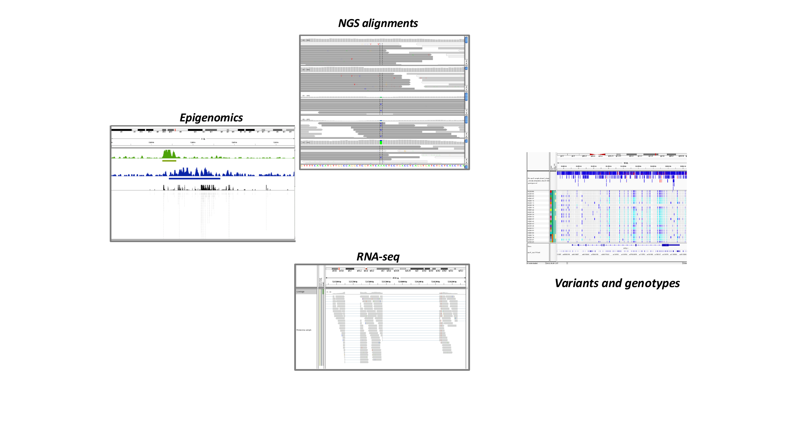
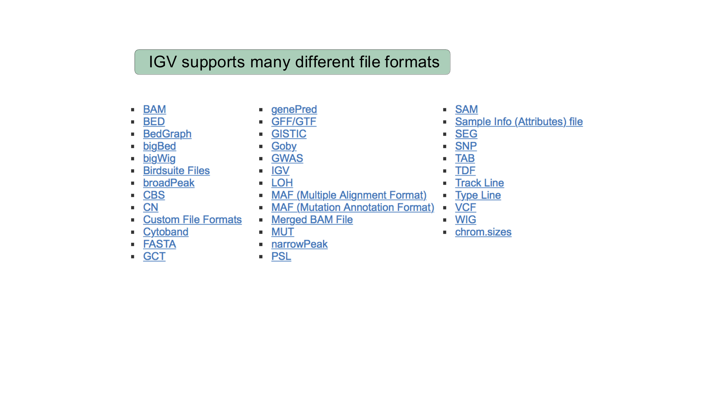

::::::::::::::::::::::::::::::::::::::: objectives

- Explain what a genome browser is and why researchers use one.
- Describe the main types of genomic data that IGV can display.
- List common file formats supported by IGV.
- Confirm that IGV is installed and launches on your machine.

::::::::::::::::::::::::::::::::::::::::::::::::::

:::::::::::::::::::::::::::::::::::::::: questions

- What is IGV and when would I use it?
- What kinds of genomic data can I explore with a genome browser?
- What file formats does IGV work with?

::::::::::::::::::::::::::::::::::::::::::::::::::

## What is a genome browser?

A genome browser is a tool for visually exploring genomic data in the context
of a reference genome. Instead of scrolling through millions of lines of a
text file, a genome browser lets you scroll and zoom along a chromosome and
see how different pieces of data — genes, sequencing reads, variants,
signal tracks — line up against one another and against the genome sequence
itself.

The **Integrative Genomics Viewer (IGV)** is a free, open-source desktop
application originally developed at the Broad Institute for exactly this
purpose. It is one of the most widely used genome browsers in genomics
because it:

- runs locally on your own computer, so you can view your own (potentially
  unpublished or sensitive) data without uploading it anywhere,
- loads large files efficiently by reading only the region you are currently
  looking at,
- supports dozens of genomics file formats out of the box, and
- lets you load many different types of data as "tracks" and stack them on
  top of each other for direct comparison.

## Why visualize genomic data?

Looking at raw output files is essential for sanity-checking a pipeline and
for building intuition about your data. A genome browser helps you:

- spot obvious problems early, such as misaligned reads, coverage gaps, or a
  mislabelled reference genome,
- distinguish a real biological signal (e.g. a heterozygous SNP, an
  alternatively spliced exon) from a technical artifact (e.g. strand bias,
  low base quality, PCR duplicates), and
- build confidence in a result before spending time on downstream analysis.

## What kinds of data can IGV display?

IGV is used across many types of genomics experiments. Four common examples
are shown below.

{alt='Screenshots of IGV showing epigenomics, NGS alignments, RNA-seq, and variant tracks'}

- **Epigenomics** — signal tracks (e.g. from ChIP-seq) showing where a
  protein of interest binds the genome, or where a histone modification is
  present.
- **NGS alignments** — individual sequencing reads aligned to the genome,
  useful for inspecting candidate SNPs, indels, and alignment quality.
- **RNA-seq** — read coverage and splice junctions across a gene, useful for
  studying gene expression and alternative splicing.
- **Variants and genotypes** — variant calls (e.g. from a VCF file) alongside
  per-sample genotypes, useful for comparing variation across many samples or
  populations.

In this lesson you will work through examples of each of these.

:::::::::::::::::::::::::::::::::::::::::  callout

## Where does the data in these tracks come from?

Most of the data types above start life as raw sequencing reads that are
aligned to a reference genome and then further processed, for example ChIP-seq
peaks are typically summarised into a coverage track (wig/bigWig) after
alignment. IGV does not do this processing for you — it visualizes the output
of upstream pipelines (alignment, variant calling, quantification). This
lesson focuses on visualization, not on how the files were generated.

::::::::::::::::::::::::::::::::::::::::::::::::::

## File formats

IGV supports a large number of standard genomics file formats. You do not
need to memorize this list, but recognizing common formats will help you
know what IGV can load directly.

{alt='List of IGV-supported file formats'}

The formats you will use in this lesson are:

| Format | Contains | Used in |
| --- | --- | --- |
| FASTA (`.fasta`/`.fa` + `.fai`) | Reference genome sequence | [Loading your own genome](03-loading-your-own-genome.md) |
| BED | Simple genomic intervals/features (e.g. genes, SNP calls) | [IGV Basics](02-igv-basics.md), [Loading your own genome](03-loading-your-own-genome.md) |
| BAM (+ `.bai` index) | Aligned sequencing reads | [Viewing alignments and SNPs](04-viewing-alignments-and-snps.md), [Precomputing coverage](05-precomputing-coverage.md) |
| TDF | Precomputed coverage/summary data | [Precomputing coverage](05-precomputing-coverage.md) |
| VCF | Variant calls and sample genotypes | [Viewing variants](07-viewing-variants.md) |

:::::::::::::::::::::::::::::::::::::::  challenge

## Confirm IGV is installed

Launch IGV on your computer now (see the [setup instructions](../learners/setup.md)
if you have not installed it yet). You should see an empty IGV window with a
genome drop-down menu in the upper left, reading something like `Human hg19`.

:::::::::::::::  solution

## Solution

If IGV opens and shows a genome selection drop-down, a chromosome ideogram,
and an empty track area below it, you are ready for the rest of the lesson.
If IGV does not launch, check that you downloaded the correct build for your
operating system and ask an instructor for help.

:::::::::::::::::::::::::

::::::::::::::::::::::::::::::::::::::::::::::::::

:::::::::::::::::::::::::::::::::::::::: keypoints

- A genome browser lets you visually explore genomic data in the context of a
  reference genome, which helps you spot problems and build intuition that
  raw files alone do not give you.
- IGV is a free, desktop genome browser that runs locally and supports many
  genomics file formats, including FASTA, BED, BAM, TDF, and VCF.
- IGV can display many types of data as tracks, including epigenomic signal,
  aligned sequencing reads, RNA-seq coverage/junctions, and variant genotypes.

::::::::::::::::::::::::::::::::::::::::::::::::::
