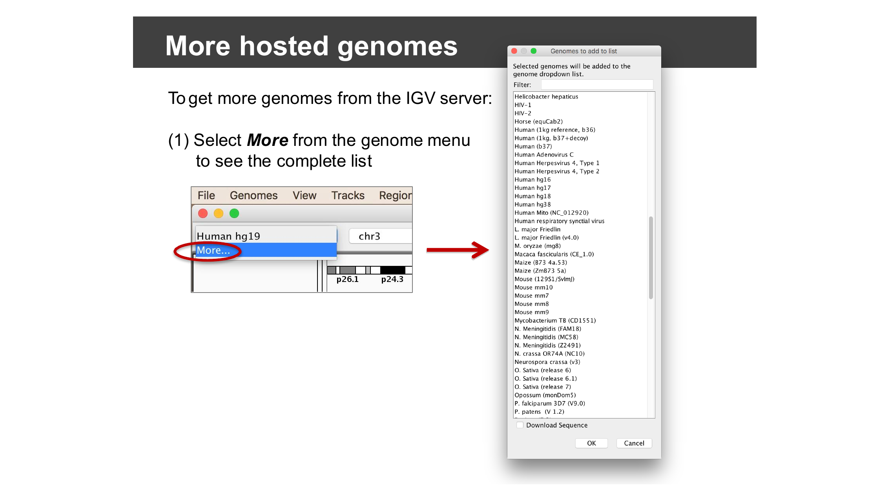
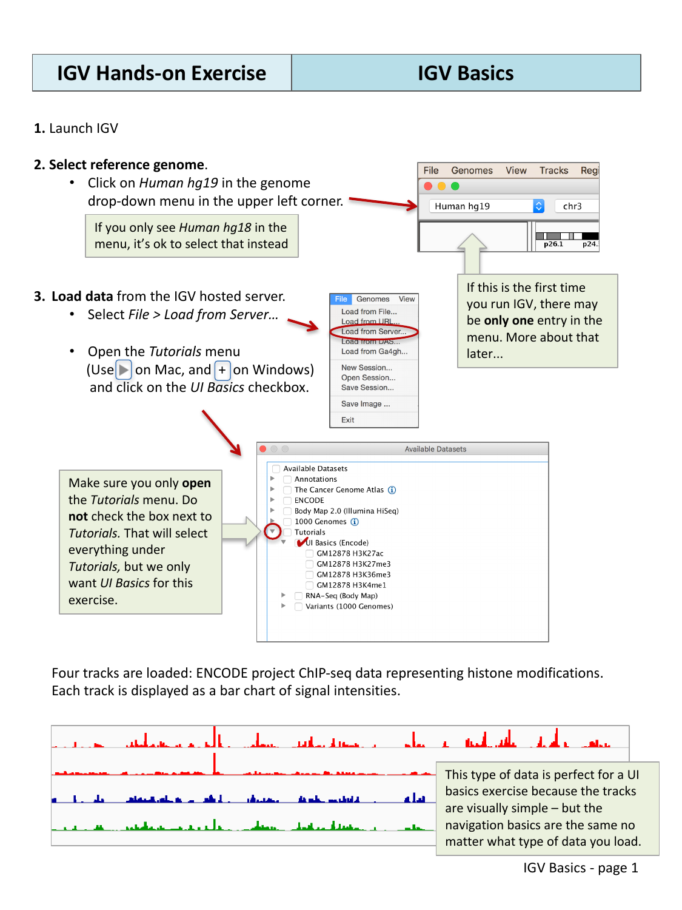
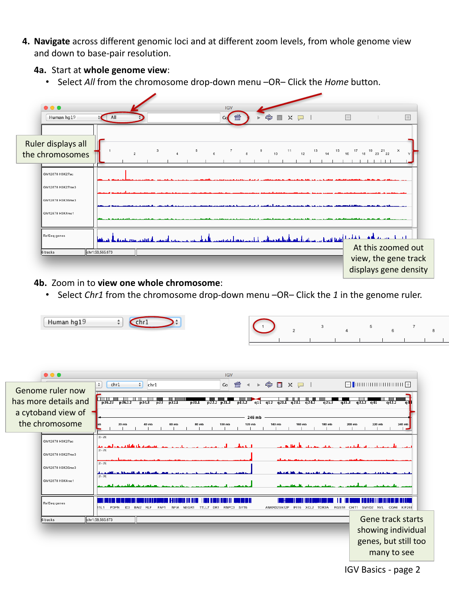
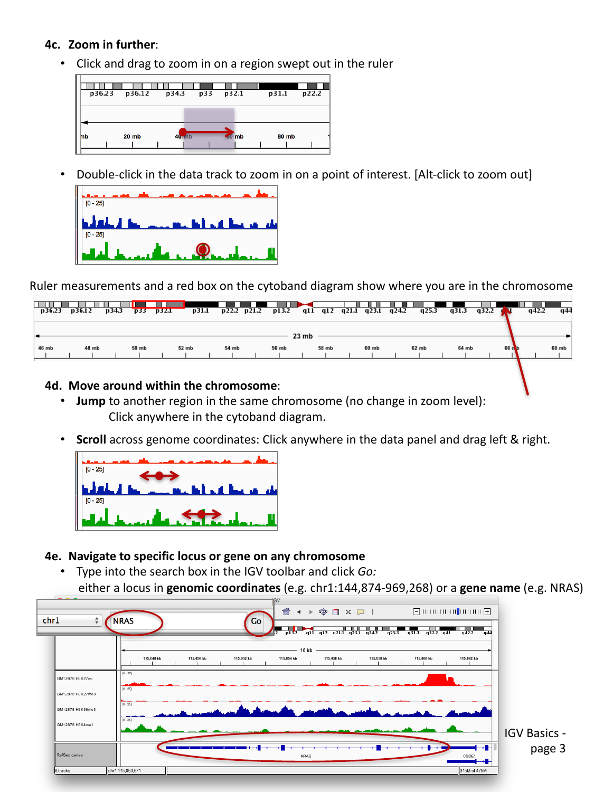
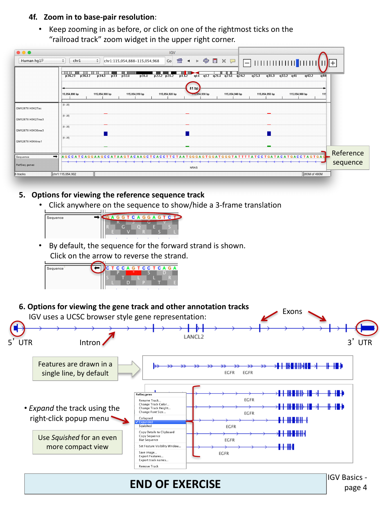
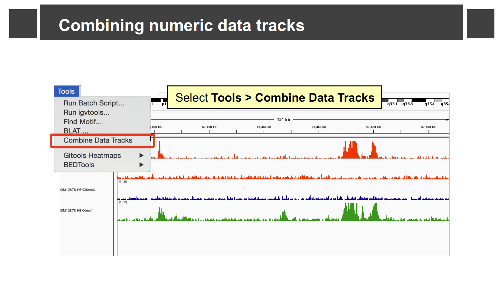
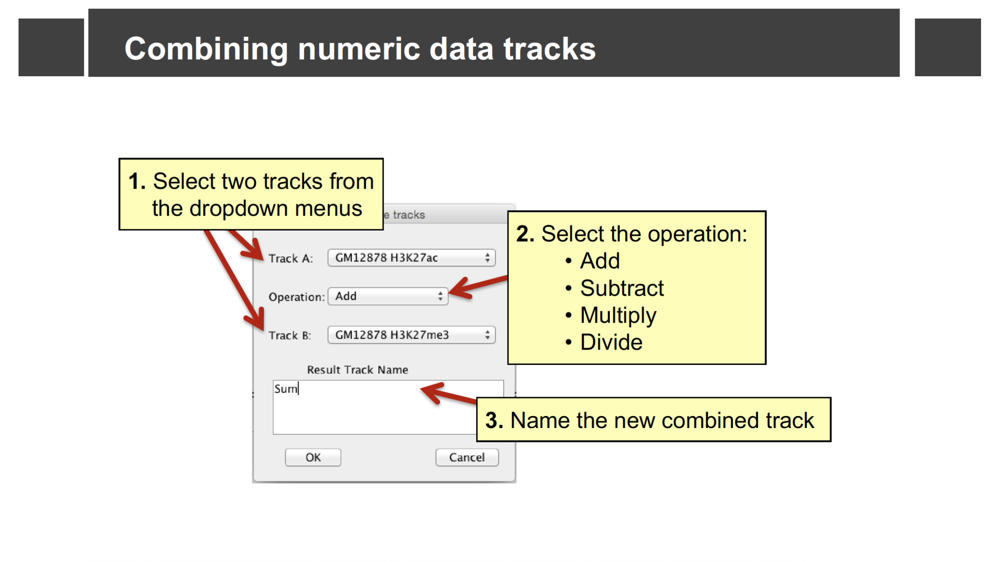
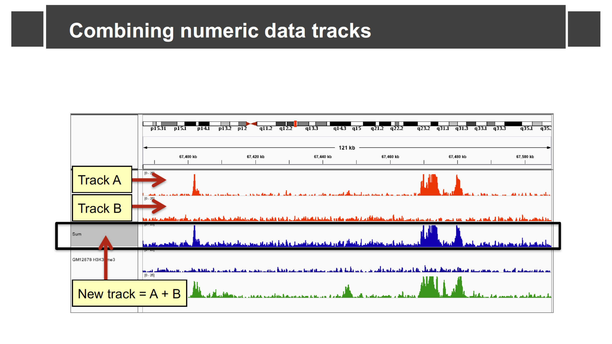

::::::::::::::::::::::::::::::::::::::: objectives

- Select a reference genome and load track data hosted on the IGV server.
- Navigate between whole-genome, chromosome, and base-pair resolution views.
- Jump directly to a genomic locus or gene by name.
- Interpret the reference sequence track and the gene annotation track.
- Combine two numeric tracks with a simple arithmetic operation.

::::::::::::::::::::::::::::::::::::::::::::::::::

:::::::::::::::::::::::::::::::::::::::: questions

- How do I load a reference genome and some example data into IGV?
- How do I move around the genome at different zoom levels?
- How do I read the sequence and gene tracks?

::::::::::::::::::::::::::::::::::::::::::::::::::

This episode uses example data hosted directly on the IGV server, so you will
need an internet connection.

## Select a reference genome

Click the genome drop-down menu in the upper left corner of IGV and select
**Human hg19**. (If you only see **Human hg18** in the menu, that is fine —
select that instead.)

:::::::::::::::::::::::::::::::::::::::::  callout

## More hosted genomes

The genome menu is short the first time you install IGV, but IGV hosts
dozens of genomes beyond human. Select **More…** from the genome drop-down
menu to browse and add other hosted genomes (bacteria, model organisms, other
builds, and more) to your menu.

{alt='Genomes to add to list dialog with dozens of hosted genomes'}

::::::::::::::::::::::::::::::::::::::::::::::::::

## Load data from the IGV server

Select **File > Load from Server…**, open the **Tutorials** menu (click the
triangle/plus next to it — do **not** check the box next to *Tutorials*
itself, or you will load everything underneath it), and check the box next to
**UI Basics (Encode)**.

{alt='IGV File > Load from Server dialog with UI Basics dataset selected'}

Four tracks are loaded: ENCODE project ChIP-seq data representing histone
modifications. Each track is displayed as a bar chart of signal intensities.
This kind of data is a good choice for learning navigation, because the
tracks are visually simple, but the navigation basics are the same no matter
what type of data you load.

## Navigate across the genome

IGV lets you move between four broad zoom levels: the whole genome, a single
chromosome, a specific region, and individual bases.

### Whole genome view

Select **All** from the chromosome drop-down menu, or click the *Home*
button, to see all chromosomes at once. At this zoomed-out view, the gene
track displays gene *density* rather than individual genes.

### One whole chromosome

Select **Chr1** from the chromosome drop-down menu, or click **1** in the
genome ruler.

{alt='IGV whole genome view and chromosome 1 view'}

The genome ruler now shows more detail and a cytoband ideogram of the
chromosome. The gene track starts showing individual genes, but there are
still too many to make out individually.

### A smaller region

Click and drag across a region in the ruler to zoom in on it. You can also
double-click anywhere in a data track to zoom in centered on that point
(<kbd>Alt</kbd>-click to zoom back out).

{alt='Zooming into a region of chromosome 1'}

As you zoom, the ruler measurements and a red box on the cytoband diagram
update to show you where you are in the chromosome.

To move around **without** changing the zoom level:

- **Jump** to another region on the same chromosome by clicking anywhere on
  the cytoband diagram.
- **Scroll** across genome coordinates by clicking anywhere in the data panel
  and dragging left or right.

### Jump to a locus or gene by name

Type a locus in genomic coordinates (e.g. `chr1:144,874,969-969,268`) or a
gene name (e.g. `NRAS`) into the search box in the toolbar and click **Go**.

### Base-pair resolution

Keep zooming in as before, or click one of the rightmost ticks on the
"railroad track" zoom widget in the upper right corner, until you can see
individual bases.

:::::::::::::::::::::::::::::::::::::::  challenge

## Navigate to a gene

Starting from whole-genome view, navigate step by step down to the gene
`NRAS`: first select **All**, then jump to **Chr1**, then use the search box
to jump straight to `NRAS`. Keep zooming in until you can read individual
bases in the sequence track.

:::::::::::::::  solution

## Solution

Typing `NRAS` into the search box and clicking **Go** takes you directly to
the gene, at a zoom level that shows the full gene body along with the loaded
ChIP-seq tracks. From there, continue zooming in (drag across the ruler,
double-click a track, or use the `+` on the zoom widget) until individual
bases and their 1-2 letter codes appear in the sequence track at the bottom.

:::::::::::::::::::::::::

::::::::::::::::::::::::::::::::::::::::::::::::::

## The reference sequence track

Once you are zoomed in far enough, a **Sequence** track appears showing the
reference genome sequence, one base per column.

{alt='IGV sequence track with 3-frame translation and gene annotation track'}

- By default, the forward strand sequence is shown. Click the arrow next to
  the sequence track to switch to the reverse strand.
- Click anywhere on the sequence track to show or hide a 3-frame amino acid
  translation.

## The gene annotation track

IGV displays gene models (like the loaded RefSeq genes track) using the same
convention as the UCSC Genome Browser: a horizontal line for introns, thicker
blocks for exons, and even thicker blocks at each end for the untranslated
regions (5' UTR and 3' UTR).

By default, overlapping transcripts for the same gene are drawn on a single
line. Right-click on the track name and choose:

- **Expanded** to draw each transcript on its own line, or
- **Squished** for an even more compact view than the default.

:::::::::::::::::::::::::::::::::::::::  challenge

## Compare gene track display modes

Navigate to a gene with multiple transcripts, such as `EGFR`. Right-click on
the *RefSeq genes* track name and try **Collapsed**, **Expanded**, and
**Squished**. What is the trade-off between these three modes?

:::::::::::::::  solution

## Solution

**Collapsed** draws all transcripts on one line (compact, but you cannot tell
transcripts apart). **Expanded** draws one transcript per line (easiest to
read individual isoforms, but takes up the most vertical space).
**Squished** also draws one transcript per line but with much thinner rows,
letting you fit many transcripts in a small space at the cost of readability.

:::::::::::::::::::::::::

::::::::::::::::::::::::::::::::::::::::::::::::::

## Combining numeric data tracks

IGV can combine two numeric (signal) tracks with a simple arithmetic
operation, which is useful for comparing or normalizing tracks without
leaving IGV. Select **Tools > Combine Data Tracks**.

{alt='Tools menu with Combine Data Tracks highlighted'}

In the dialog, pick **Track A** and **Track B** from the loaded numeric
tracks (for example, two of the ChIP-seq tracks you loaded earlier), choose
an **Operation** (Add, Subtract, Multiply, or Divide), and name the result.

{alt='Combine Data Tracks dialog with Track A, Operation, Track B, and Result Track Name fields'}

IGV adds a new track computed from the two source tracks at every position.

{alt='New combined track showing the sum of two ChIP-seq tracks'}

:::::::::::::::::::::::::::::::::::::::  challenge

## Combine two of the loaded ChIP-seq tracks

Using the four ENCODE ChIP-seq tracks loaded earlier in this episode, add
two of them together with **Tools > Combine Data Tracks**. How does the
combined track's shape compare to its two source tracks?

:::::::::::::::  solution

## Solution

The combined ("Sum") track shows a peak wherever *either* source track has a
peak, with the height reflecting the total signal from both tracks at that
position. This kind of combination is useful, for example, to see a
combined read-density signal without switching your eyes back and forth
between two separate tracks.

:::::::::::::::::::::::::

::::::::::::::::::::::::::::::::::::::::::::::::::

:::::::::::::::::::::::::::::::::::::::: keypoints

- Load a reference genome first, then load data tracks with **File > Load
  from Server…** or **File > Load from File…**; use **Genomes > More…** to
  add other hosted genomes beyond the default.
- IGV supports four broad zoom levels: whole genome, chromosome, region, and
  base-pair resolution; drag on the ruler, double-click a track, or use the
  search box to move between them.
- The sequence track shows the reference genome and, optionally, a 3-frame
  translation; the gene track shows exons, introns, and UTRs, and can be
  displayed collapsed, expanded, or squished.
- **Tools > Combine Data Tracks** lets you add, subtract, multiply, or divide
  two numeric tracks into a new derived track.

::::::::::::::::::::::::::::::::::::::::::::::::::
