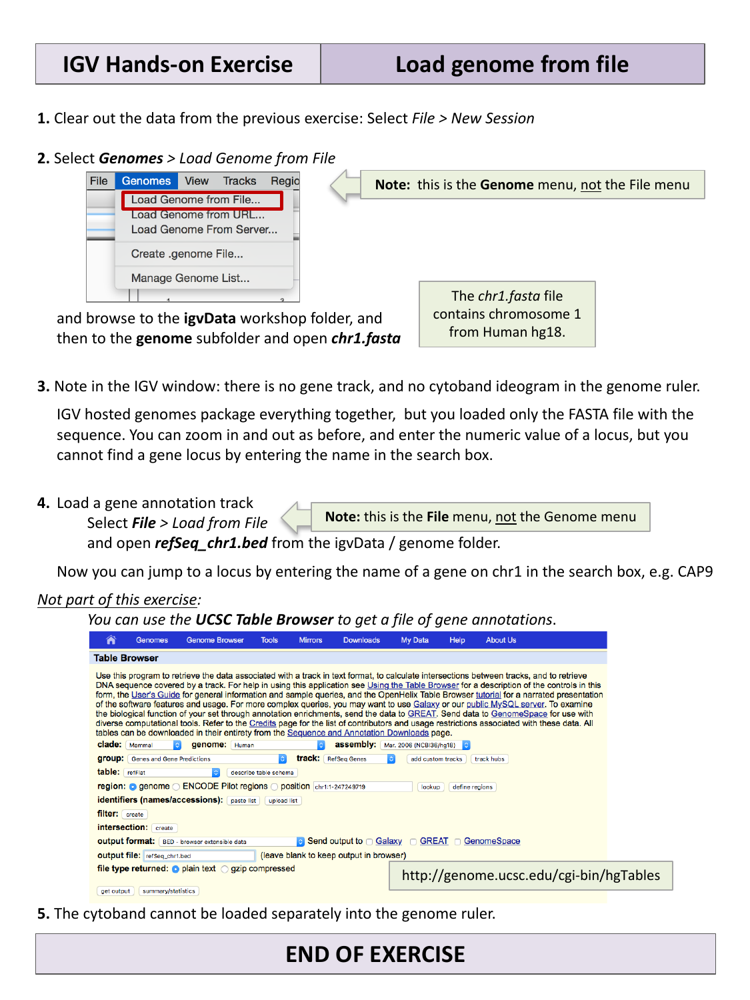

::::::::::::::::::::::::::::::::::::::: objectives

- Load a reference genome from a local FASTA file.
- Add a gene annotation track from a local BED file.
- Explain why loading a genome from a FASTA file alone does not give you gene
  names or a cytoband ideogram.

::::::::::::::::::::::::::::::::::::::::::::::::::

:::::::::::::::::::::::::::::::::::::::: questions

- How do I view my own genome, rather than one of IGV's built-in hosted
  genomes?
- What do I lose by loading a genome from a FASTA file instead of one of
  IGV's packaged genomes?

::::::::::::::::::::::::::::::::::::::::::::::::::

The rest of this lesson uses your own local copy of chromosome 1 rather than
data hosted on the IGV server, so from here on you will not need an internet
connection. This episode uses files from the `igvData` folder you downloaded
in [Setup](../learners/setup.md).

## Clear out the previous session

Select **File > New Session** to clear the tracks and genome loaded in the
previous episode.

## Load a genome from a FASTA file

Select **Genomes > Load Genome from File…** (note: this is the **Genomes**
menu, not the **File** menu), then browse to `igvData/genome/` and open
`chr1.fasta`. This file contains chromosome 1 from human genome build hg18.

{alt='IGV Genomes > Load Genome from File dialog'}

Notice that there is now no gene track and no cytoband ideogram in the genome
ruler. IGV's hosted genomes package a reference sequence together with a
default gene annotation and cytoband data, but here you loaded only the FASTA
sequence — so IGV has nothing else to show yet. You can still zoom in and out
and enter numeric coordinates, but you cannot yet jump to a locus by gene
name, because IGV does not know where any genes are.

## Add a gene annotation track

Select **File > Load from File…** (note: this time it *is* the **File**
menu), and open `refSeq_chr1.bed` from `igvData/genome/`.

Now you can jump to a locus by typing the name of a gene on chromosome 1 into
the search box, for example `CAP9`.

:::::::::::::::::::::::::::::::::::::::  challenge

## Jump to a gene by name

Before loading `refSeq_chr1.bed`, try typing a gene name (e.g. `CAP9`) into
the search box and clicking **Go**. What happens? Now load
`refSeq_chr1.bed` and try again.

:::::::::::::::  solution

## Solution

Before the BED file is loaded, IGV has no record of where any genes are
located, so searching by gene name fails (or is silently ignored) — you can
only navigate using numeric coordinates. After loading `refSeq_chr1.bed`, IGV
can match the gene name against the annotation track and jump straight to it.

:::::::::::::::::::::::::

::::::::::::::::::::::::::::::::::::::::::::::::::

:::::::::::::::::::::::::::::::::::::::::  callout

## Where do gene annotation files come from?

The `refSeq_chr1.bed` file used here was generated from the
[UCSC Table Browser](https://genome.ucsc.edu/cgi-bin/hgTables), a web tool for
retrieving data associated with a genome assembly (gene models, regulatory
regions, and more) as a downloadable file. This is a common way to obtain a
gene annotation track for a genome that is not already bundled with one.

::::::::::::::::::::::::::::::::::::::::::::::::::

Note that, unlike the gene track, the cytoband ideogram cannot be loaded
separately — it is only available for genomes that package it in already.

:::::::::::::::::::::::::::::::::::::::: keypoints

- Load a custom genome sequence with **Genomes > Load Genome from File…**;
  load additional annotation tracks (genes, features) with **File > Load
  from File…**.
- A genome loaded from a bare FASTA file has no gene names or cytoband
  ideogram until you add that information yourself as separate tracks.

::::::::::::::::::::::::::::::::::::::::::::::::::
