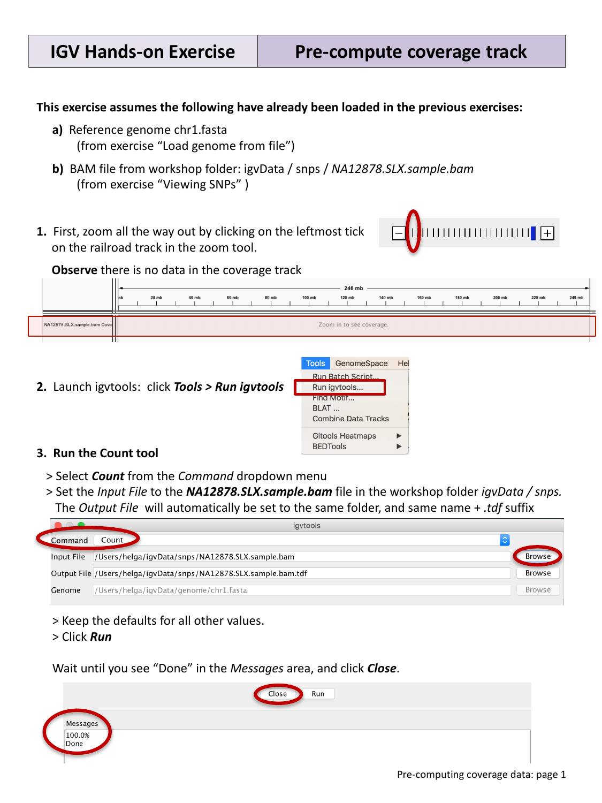
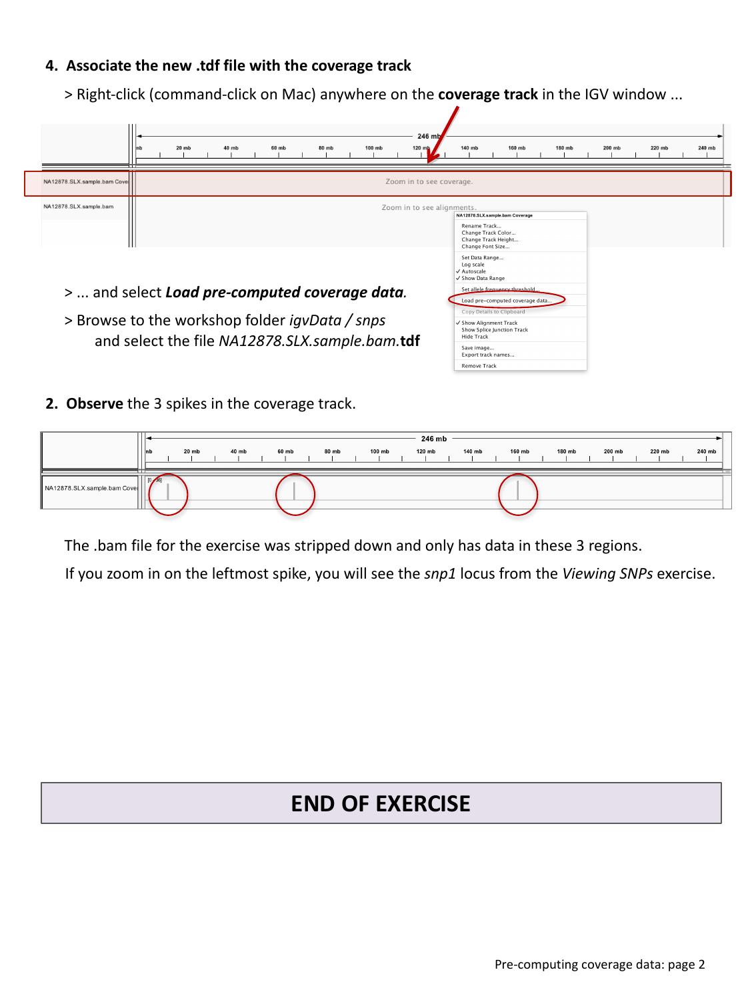

::::::::::::::::::::::::::::::::::::::: objectives

- Explain why coverage disappears when zooming out on a large BAM file.
- Use `igvtools` to precompute a coverage summary (TDF) file.
- Associate a precomputed coverage file with an alignment track.

::::::::::::::::::::::::::::::::::::::::::::::::::

:::::::::::::::::::::::::::::::::::::::: questions

- Why does my coverage track go blank when I zoom out?
- How do I precompute coverage data so it is visible at any zoom level?

::::::::::::::::::::::::::::::::::::::::::::::::::

This episode assumes you already have loaded, from the previous episodes:

- the reference genome `chr1.fasta`, and
- the alignment file `igvData/snps/NA12878.SLX.sample.bam`.

## The problem: no coverage at low zoom levels

Zoom all the way out by clicking the leftmost tick on the "railroad track"
zoom widget. Notice that the coverage track for `NA12878.SLX.sample.bam` now
shows no data at all, just a message like "Zoom in to see coverage."

{alt='Zoomed-out view showing no coverage data, and the igvtools Run dialog'}

By default, IGV computes coverage on the fly from the reads currently visible
in a BAM file. At low zoom levels this would mean scanning huge numbers of
reads just to draw a rough summary, so IGV instead only computes coverage
once you are zoomed in far enough that this is fast. To see accurate coverage
at *any* zoom level, you need to precompute it once, ahead of time, using the
`igvtools` **Count** function.

## Precompute coverage with igvtools

Select **Tools > Run igvtools…**, then in the dialog:

1. Select **Count** from the *Command* drop-down menu.
2. Set the *Input File* to `NA12878.SLX.sample.bam` in `igvData/snps/`. The
  *Output File* will automatically be set to the same folder and file name,
  with a `.tdf` suffix added.
3. Keep the defaults for all other values, and click **Run**.

Wait until the *Messages* area shows "Done", then click **Close**.

## Associate the TDF file with the coverage track

Right-click (Mac: control-click) anywhere on the **coverage track** for
`NA12878.SLX.sample.bam` in the IGV window, and select **Load pre-computed
coverage data…**. Browse to `igvData/snps/` and select the new
`NA12878.SLX.sample.bam.tdf` file.

{alt='Loading precomputed coverage data and the resulting coverage spikes'}

You should now see three spikes of coverage across the whole chromosome. This
sample BAM file was deliberately stripped down for the workshop and only
contains reads in these three regions — the leftmost spike corresponds to the
`snp1` locus from the previous episode.

:::::::::::::::::::::::::::::::::::::::  challenge

## Zoom back in

Zoom in on the leftmost coverage spike until you reach base-pair resolution.
What locus do you land on?

:::::::::::::::  solution

## Solution

Zooming into the leftmost spike brings you back to the `snp1` locus explored
in [Viewing Alignments and SNPs](04-viewing-alignments-and-snps.md) — the
precomputed coverage track and the on-the-fly coverage you saw there are
showing the same underlying reads, just computed differently depending on
zoom level.

:::::::::::::::::::::::::

::::::::::::::::::::::::::::::::::::::::::::::::::

:::::::::::::::::::::::::::::::::::::::: keypoints

- IGV computes BAM coverage on the fly at high zoom levels, but does not
  attempt this at low zoom levels for performance reasons.
- Use **Tools > Run igvtools… > Count** to precompute a `.tdf` coverage
  summary file for a BAM file.
- Attach a precomputed `.tdf` file to a coverage track via right-click **>
  Load pre-computed coverage data…**.

::::::::::::::::::::::::::::::::::::::::::::::::::
