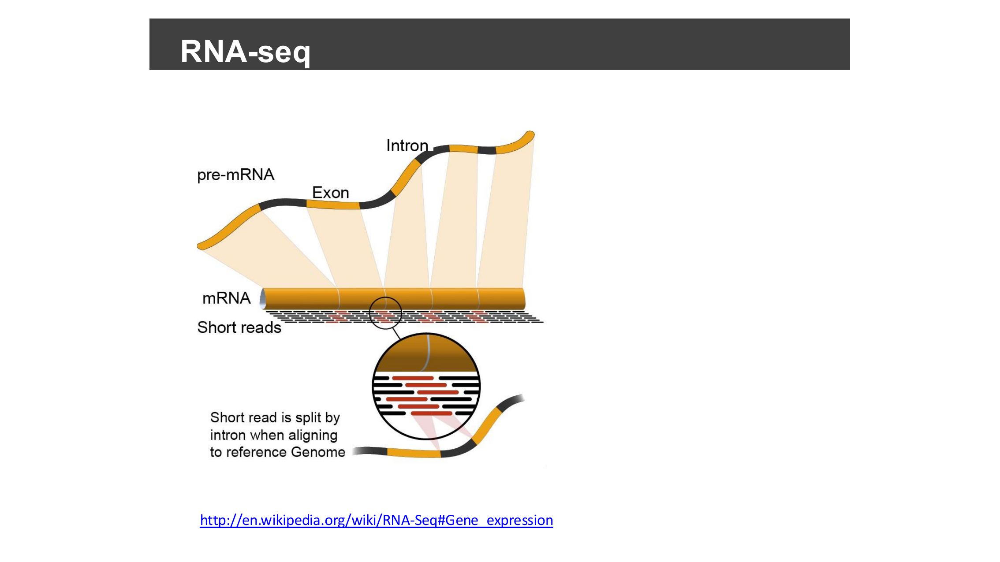
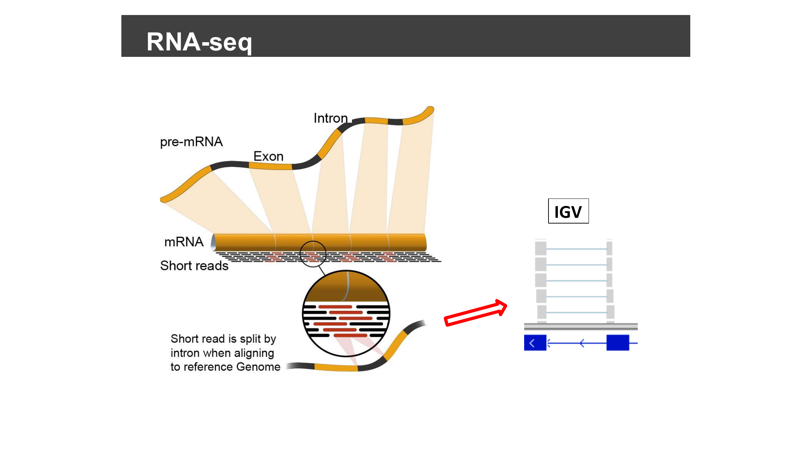
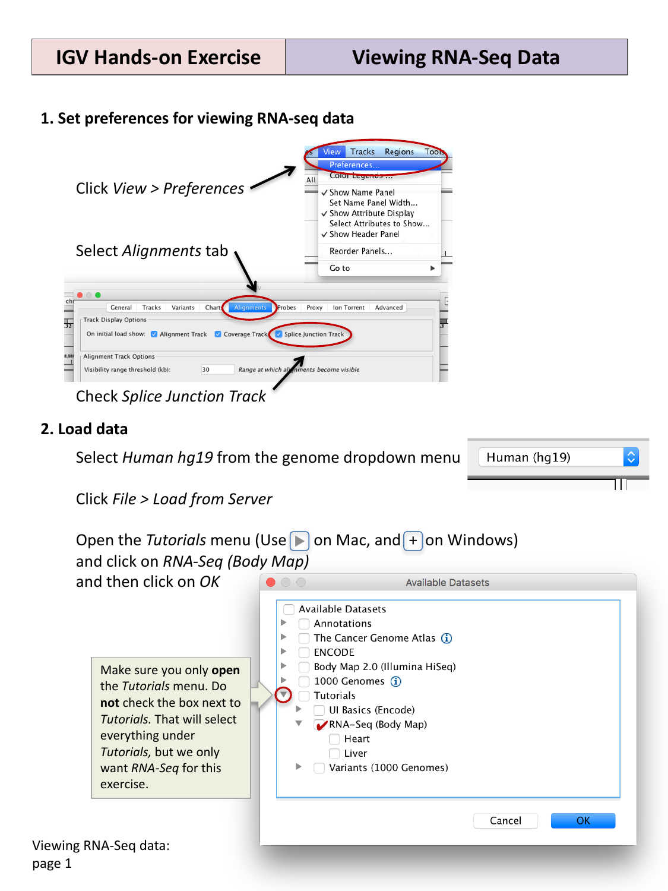
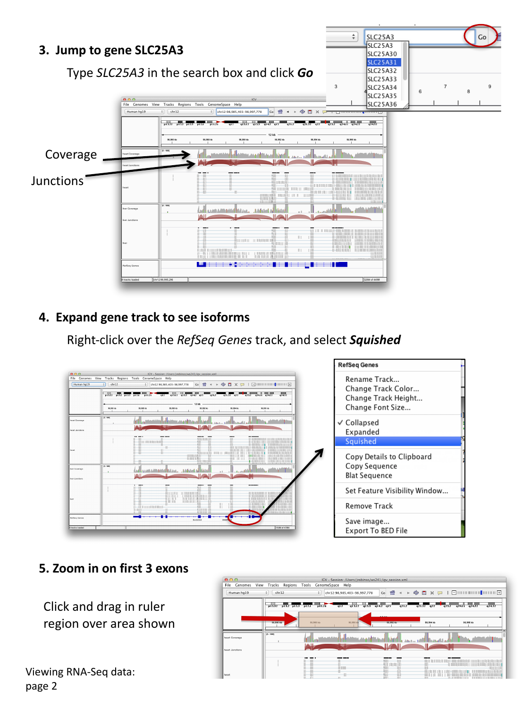
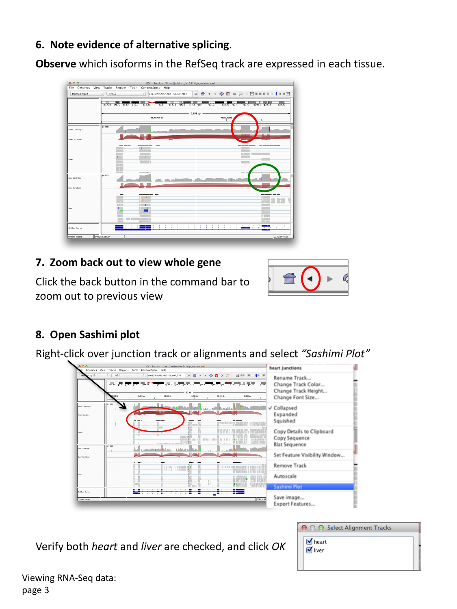
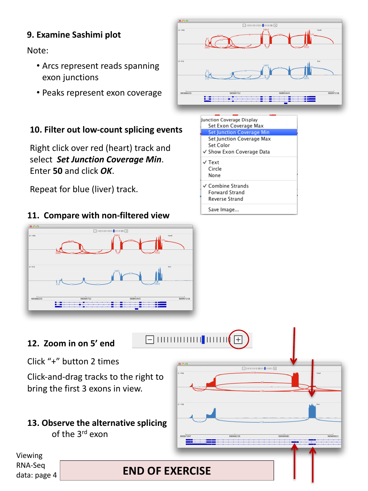

::::::::::::::::::::::::::::::::::::::: objectives

- Enable the splice junction track for RNA-seq alignment data.
- Load RNA-seq data hosted on the IGV server for two tissues.
- Interpret coverage and splice junction tracks to identify alternative
  splicing.
- Generate and interpret a Sashimi plot.

::::::::::::::::::::::::::::::::::::::::::::::::::

:::::::::::::::::::::::::::::::::::::::: questions

- How do I see which exons are spliced together in RNA-seq data?
- How do I compare splicing patterns between two samples or tissues?
- Why do RNA-seq reads look different from the DNA reads in the previous
  episode when aligned in IGV?

::::::::::::::::::::::::::::::::::::::::::::::::::

## Background: why RNA-seq alignments look "split"

RNA-seq sequences mature mRNA, not genomic DNA. By the time a gene's
pre-mRNA becomes mRNA, its introns have already been spliced out, so the
short reads generated from it are sampled from a continuous stretch of
joined-together exons, with no intron sequence in between.

{alt='Diagram of pre-mRNA being spliced into mRNA, with short reads sampled from the spliced transcript'}

The reference genome, however, still contains the introns. So when an
RNA-seq read happens to span two exons, aligning it back to the genome
means the aligner has to split that one read into two pieces with a gap
between them — the gap corresponds to the intron that was removed from the
mRNA. This is exactly the "read spanning a splice junction" you will see
represented as a gapped alignment, and later as an arc in the splice
junction track.

{alt='Diagram extending the splicing illustration with an arrow showing the resulting gapped alignment in IGV'}

(Diagram source: [Wikipedia, RNA-Seq § Gene expression](https://en.wikipedia.org/wiki/RNA-Seq#Gene_expression).)

This episode uses example RNA-seq data hosted on the IGV server, so you will
need an internet connection.

## Set preferences to show splice junctions

Select **View > Preferences…**, then the **Alignments** tab, and check
**Splice Junction Track** under "On initial load show".

## Load RNA-seq data

Select **Human hg19** from the genome drop-down menu. Then select **File >
Load from Server…**, open the **Tutorials** menu, check the box next to
**RNA-Seq (Body Map)**, and click **OK**.

{alt='IGV Preferences dialog and Load from Server dialog for RNA-seq data'}

This loads coverage, alignment, and splice junction tracks for two tissues:
**heart** and **liver**.

## Jump to a gene and explore isoforms

Type `SLC25A3` into the search box and click **Go**.

{alt='SLC25A3 coverage, junctions, and squished RefSeq gene track'}

You should see, for each tissue:

- a **coverage** track (how many reads cover each position), and
- a **junctions** track (arcs connecting exons that were spliced together in
  at least one read).

Right-click the *RefSeq Genes* track and select **Squished** to reveal
multiple isoforms of the gene on separate, compact rows.

## Look for evidence of alternative splicing

Zoom in on the first three exons by clicking and dragging in the ruler over
that region. Compare which isoforms in the RefSeq track are consistent with
the coverage and junction pattern seen in each tissue.

:::::::::::::::::::::::::::::::::::::::  challenge

## Spot the difference between tissues

Looking at the heart and liver coverage/junction tracks side by side around
the first few exons, can you find a region where one tissue shows a peak of
coverage (an exon being used) that the other tissue does not?

:::::::::::::::  solution

## Solution

Around the first few exons of `SLC25A3`, one tissue shows a small "bump" of
coverage — indicating a short exon or extra exonic sequence — that is
absent, or much lower, in the other tissue. This is a sign of a
tissue-specific alternatively spliced exon: the same gene locus produces
different transcript isoforms depending on which tissue the RNA was
sequenced from.

:::::::::::::::::::::::::

::::::::::::::::::::::::::::::::::::::::::::::::::

Zoom back out to view the whole gene again using the back button in the
command bar.

## Sashimi plots

A Sashimi plot is a specialized view for RNA-seq splicing that combines
coverage and junction arcs into a single, cleaner visualization. Right-click
over a junction track (or the alignments) and select **Sashimi Plot**. If
prompted to select alignment tracks, verify that both **heart** and
**liver** are checked, and click **OK**.

{alt='Right-click menu for opening a Sashimi Plot, with a dialog to select the heart and liver alignment tracks'}

{alt='Sashimi plot for heart and liver samples showing junction arcs and coverage peaks'}

In a Sashimi plot:

- **Arcs** represent reads spanning an exon-exon junction; the number on the
  arc is the number of supporting reads.
- **Peaks** represent per-base exon coverage.

### Filter out low-count splicing events

Real datasets often contain many low-count, spurious-looking junctions.
Right-click over one track (e.g. the red/heart track) and select **Set
Junction Coverage Min**. Enter `50` and click **OK**. Repeat for the other
track (e.g. blue/liver).

Compare this filtered view to the original, unfiltered one — filtering makes
it much easier to see the dominant, well-supported splicing pattern in each
tissue, without being distracted by rare junctions.

:::::::::::::::::::::::::::::::::::::::  challenge

## Confirm alternative splicing of the third exon

Zoom in on the 5' end of the gene (click "+" on the zoom widget a couple of
times, then click-and-drag the tracks to bring the first three exons into
view). Compare the junction arcs for heart and liver around the third exon.

:::::::::::::::  solution

## Solution

One tissue's junction arcs skip over the third exon entirely (an arc jumps
directly from exon 2 to exon 4), while the other tissue's arcs include a
junction into and out of exon 3. This is direct evidence, at the level of
individual spliced reads, that exon 3 is alternatively spliced (included in
one tissue's dominant transcript, but skipped in the other's).

:::::::::::::::::::::::::

::::::::::::::::::::::::::::::::::::::::::::::::::

:::::::::::::::::::::::::::::::::::::::: keypoints

- RNA-seq reads come from spliced mRNA (introns already removed), so a read
  spanning two exons aligns back to the intron-containing genome as a
  gapped, "split" alignment.
- Enable the splice junction track (via **View > Preferences > Alignments**)
  to see, as arcs, which exons are spliced together in RNA-seq data.
- Compare coverage and junction tracks across samples or tissues to spot
  alternative splicing.
- A Sashimi plot combines exon coverage (peaks) and junction reads (arcs) in
  one view, and read-count filtering helps focus on well-supported junctions.

::::::::::::::::::::::::::::::::::::::::::::::::::
