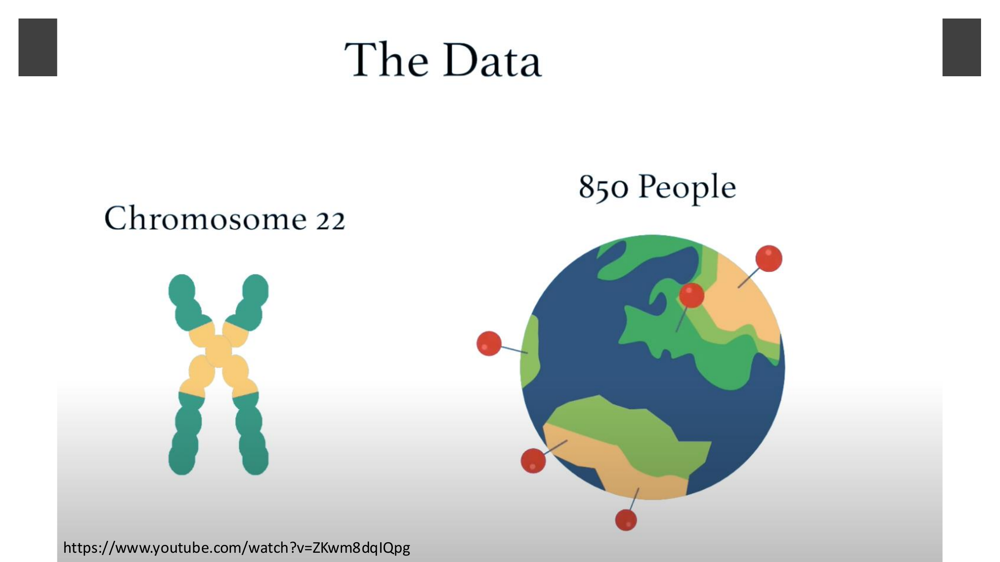
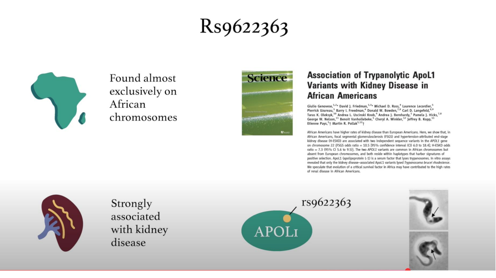
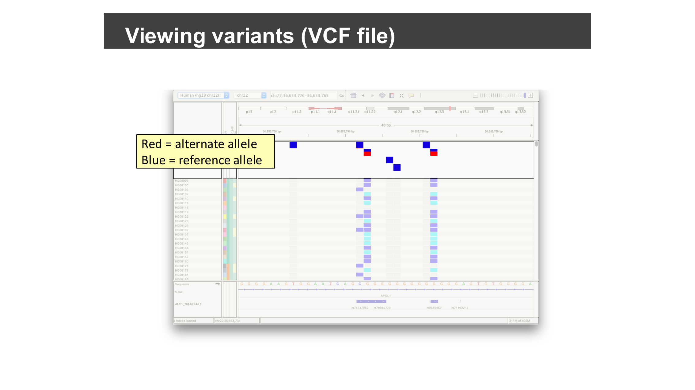
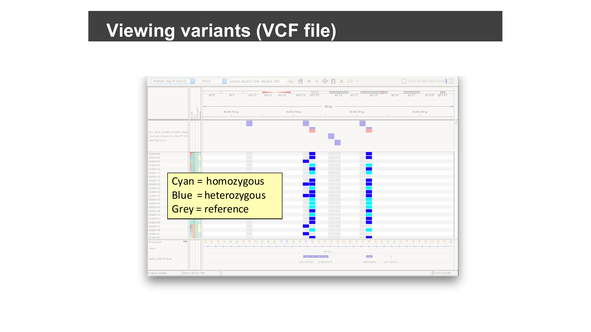
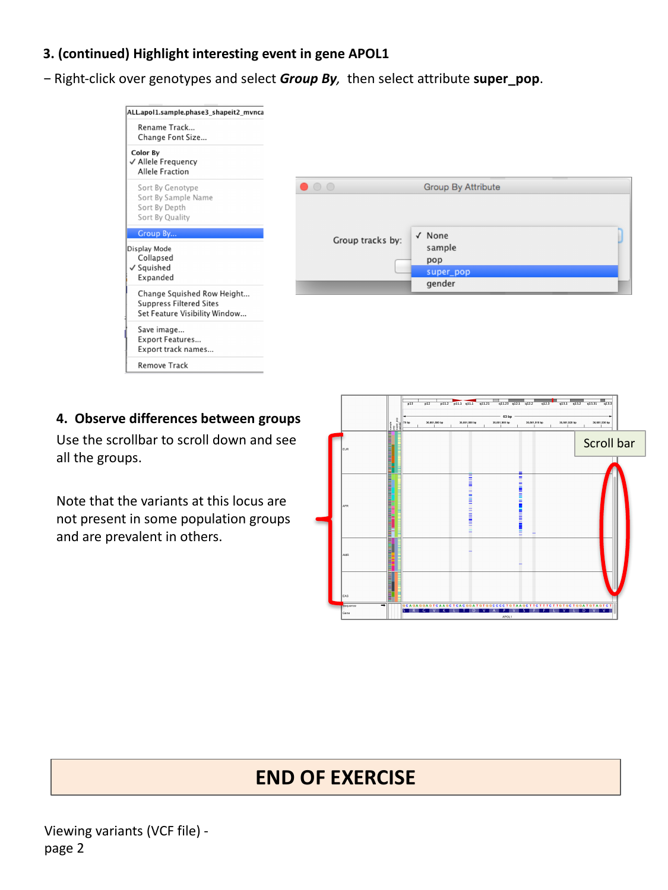

::::::::::::::::::::::::::::::::::::::: objectives

- Load a multi-sample VCF file together with its sample metadata.
- Distinguish the variant sites panel from the per-sample genotypes panel.
- Interpret the allele and genotype color coding IGV uses.
- Group and compare genotypes across sample populations.

::::::::::::::::::::::::::::::::::::::::::::::::::

:::::::::::::::::::::::::::::::::::::::: questions

- How does IGV display variants and genotypes from a VCF file?
- How can I compare variant patterns across groups of samples, such as
  populations?

::::::::::::::::::::::::::::::::::::::::::::::::::

## Why this dataset?

The VCF session you will load contains variant calls on human chromosome 22
for about 850 people sampled from populations around the world — a subset of
the [1000 Genomes Project](https://www.internationalgenome.org/) dataset.

{alt='Chromosome 22 and a world map marking sampled populations'}

Zoomed in on the *APOL1* gene, one particular marker, `rs9622363`, tells a
striking evolutionary story.

{alt='APOL1 background slide: African-specific variant associated with kidney disease and trypanolytic activity'}

*APOL1* encodes a protein that can lyse the parasite that causes African
sleeping sickness, and coding variants in the gene — found almost
exclusively on chromosomes of African ancestry — strengthen that protective
effect. But the same variants come at a cost: Genovese and colleagues showed
they are also strongly associated with elevated rates of kidney disease in
African Americans (Genovese *et al.*, "Association of Trypanolytic ApoL1
Variants with Kidney Disease in African Americans," *Science*, 2010). This is
exactly the kind of population-specific signal you will be able to spot for
yourself later in this episode by grouping genotypes by population.

## Load the session

This exercise uses a pre-built IGV session that loads a population VCF file
together with sample attribute information (population and sex for each
sample). Select **File > Open Session…**, navigate to `igvData/vcf/`, and
open `vcf_session.xml`.

## Observe the variant and genotype panels

IGV splits VCF data into two panels:

- a **variant sites** panel (one row) showing where variants are located
  along the genome, and
- a **genotypes** panel (one row per sample) showing each sample's genotype
  at every variant site.

{alt='IGV VCF session with variant sites, genotypes, and sample info panel'}

Hover over a variant site or a genotype cell to see its details in a popup.
(If you changed the popup behavior earlier to "on click", click instead of
hovering.)

Both panels use color to summarize a lot of information at a glance:

- In the **variant sites** panel, blue marks the reference allele and red
  marks the alternate allele at each site.

  {alt='Variant sites colored blue for reference allele and red for alternate allele'}

- In the **genotypes** panel, cyan marks a homozygous (alternate/alternate)
  genotype, blue marks heterozygous (reference/alternate), and grey marks
  homozygous reference.

  {alt='Genotypes colored cyan for homozygous, blue for heterozygous, grey for reference'}

A narrow **sample information** column to the left of the genotypes uses
color to represent each sample's metadata (e.g. population). Samples sharing
the same value are shown in the same color. Try clicking on the sample
information column headers to sort samples by an attribute.

:::::::::::::::::::::::::::::::::::::::::  callout

## Where does the sample information come from?

Sample metadata is defined in an auxiliary tab-delimited file, separate from
the VCF itself: the first row names the metadata columns (e.g. `sample`,
`pop`, `super_pop`, `gender`), and the first column holds sample names that
must exactly match the sample names in the VCF. The pre-built session you
loaded already references this file, but you can add the same kind of
sample-information file to your own VCF tracks.

{alt='Tab-delimited sample information file with sample, pop, super_pop, and gender columns'}

::::::::::::::::::::::::::::::::::::::::::::::::::

## Highlight variants in a gene of interest

Type `APOL1:S342G` into the search box and click **Go** to jump to a specific
amino-acid-level variant in the *APOL1* gene.

Right-click over the genotypes track and select **Display Mode: Squished**
to make room for more samples on screen at once.

## Group samples by population

Right-click over the genotypes track again, select **Group By…**, and choose
the **super_pop** attribute.

{alt='Group By dialog and genotypes grouped by super population'}

Use the scrollbar to scroll down through all the population groups.

:::::::::::::::::::::::::::::::::::::::  challenge

## Compare variant frequency across populations

At the `APOL1:S342G` locus, scroll through the population groups you just
created. Is this variant equally common in every population group?

:::::::::::::::  solution

## Solution

No — the variants at this locus are not evenly distributed. They are absent,
or nearly absent, in some population groups, and much more prevalent in
others, consistent with the African-specific selective history of *APOL1*
variants described earlier in this episode. This kind of population-stratified
pattern is common for variants under different selective pressures (or
genetic drift) in different ancestral populations, and grouping genotypes by
population makes this kind of pattern immediately visible, without needing to
compute allele frequencies separately for each group.

:::::::::::::::::::::::::

::::::::::::::::::::::::::::::::::::::::::::::::::

:::::::::::::::::::::::::::::::::::::::::  callout

## Coloring genotypes

The genotype track's right-click menu also offers **Color By > Allele
Frequency** or **Allele Fraction**, and options to sort by genotype, sample
name, depth, or quality — useful alternatives or complements to grouping by a
sample attribute.

::::::::::::::::::::::::::::::::::::::::::::::::::

:::::::::::::::::::::::::::::::::::::::::  callout

## Watch: IGV VCF Basics

<iframe style="width:100%;max-width:560px;aspect-ratio:16/9;" src="https://www.youtube.com/embed/EpD2ZHM7Q8Q" title="IGV | VCF Basics | VCF File Explanation & Viewing in IGV" frameborder="0" allow="accelerometer; autoplay; clipboard-write; encrypted-media; gyroscope; picture-in-picture; web-share" referrerpolicy="strict-origin-when-cross-origin" allowfullscreen></iframe>

::::::::::::::::::::::::::::::::::::::::::::::::::

:::::::::::::::::::::::::::::::::::::::: keypoints

- A VCF track in IGV has a variant sites panel and a per-sample genotypes
  panel; a sample information color bar (driven by an auxiliary tab-delimited
  file) can show sample metadata such as population.
- Variant sites are colored blue (reference allele) / red (alternate allele);
  genotypes are colored grey (homozygous reference) / blue (heterozygous) /
  cyan (homozygous alternate).
- Search for a variant using `gene:protein-change` syntax (e.g.
  `APOL1:S342G`) as well as by coordinate or gene name.
- Grouping genotypes by a sample attribute (e.g. population) makes it easy to
  compare variant patterns across groups of samples.

::::::::::::::::::::::::::::::::::::::::::::::::::
