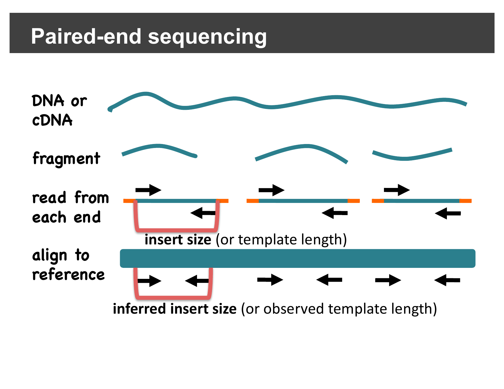
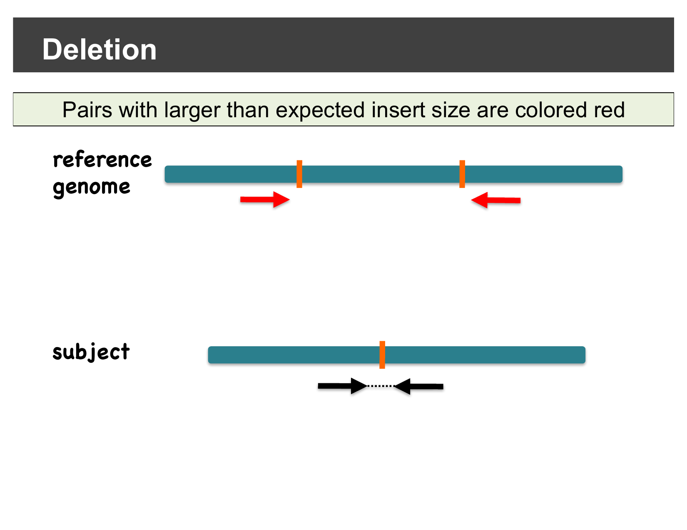
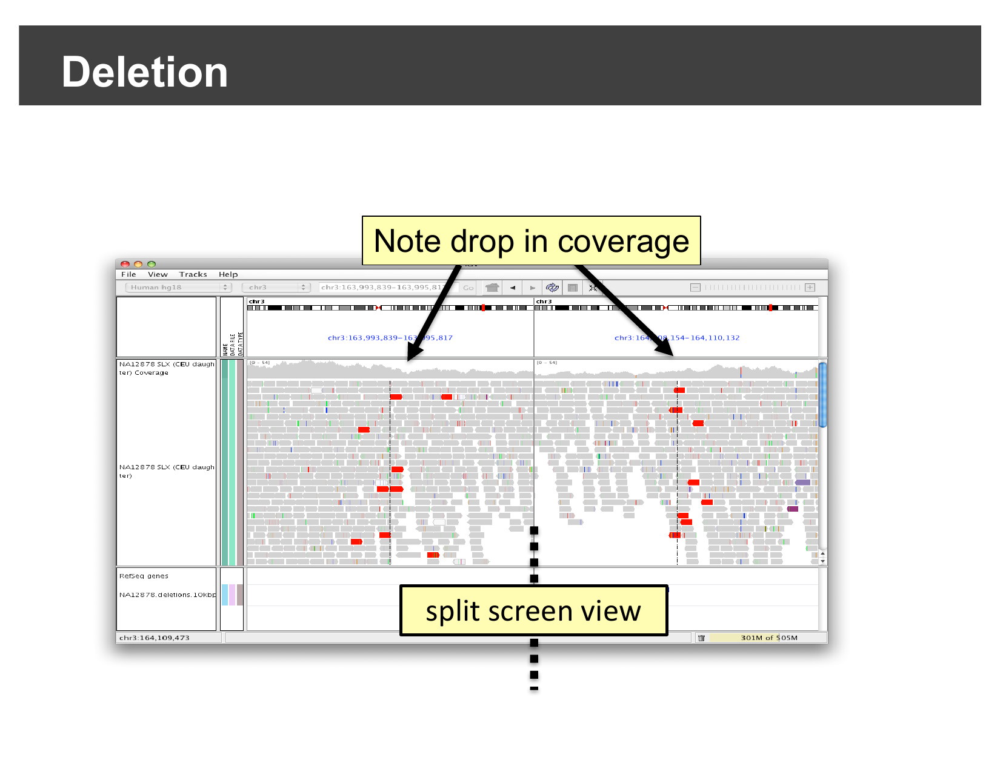
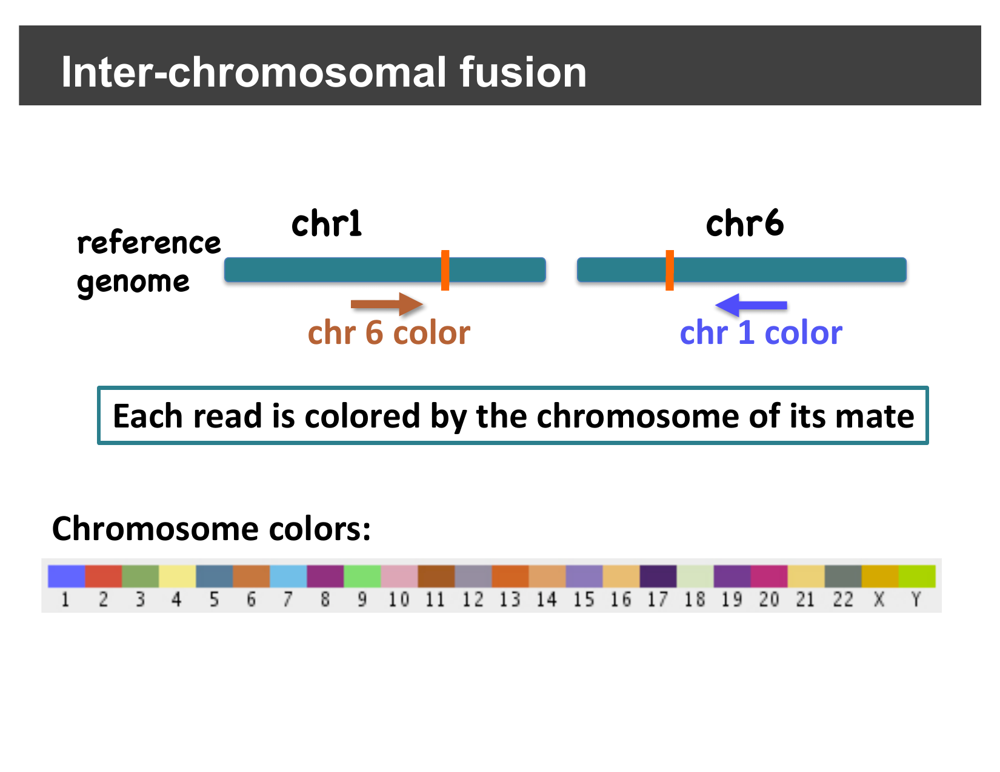
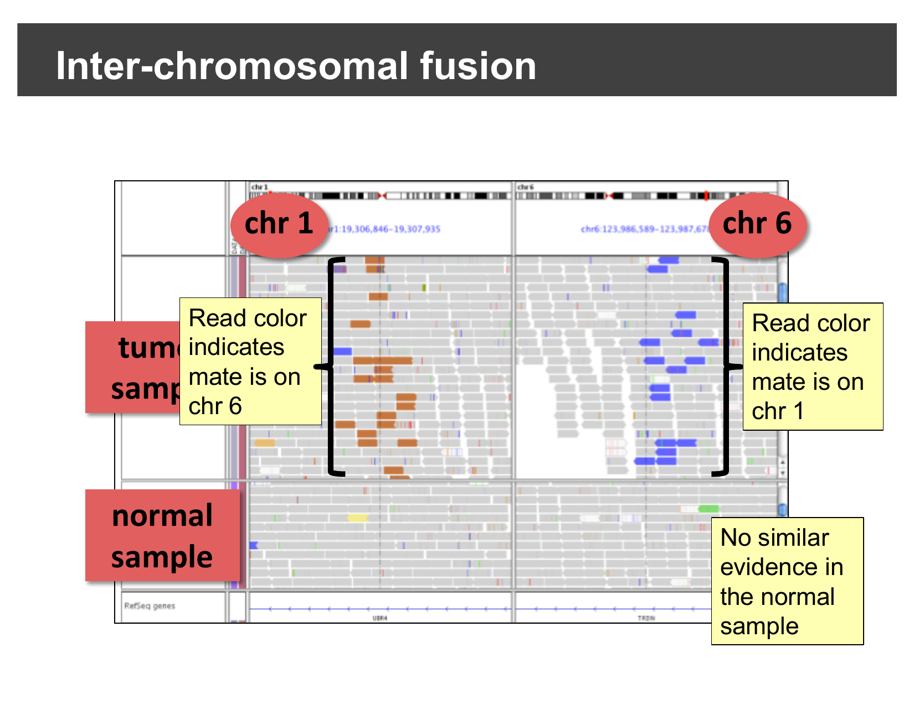
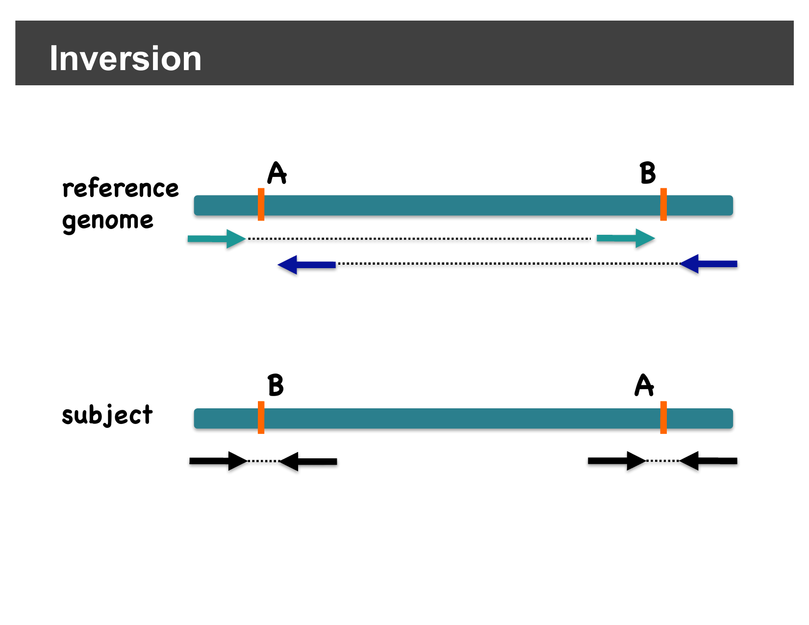
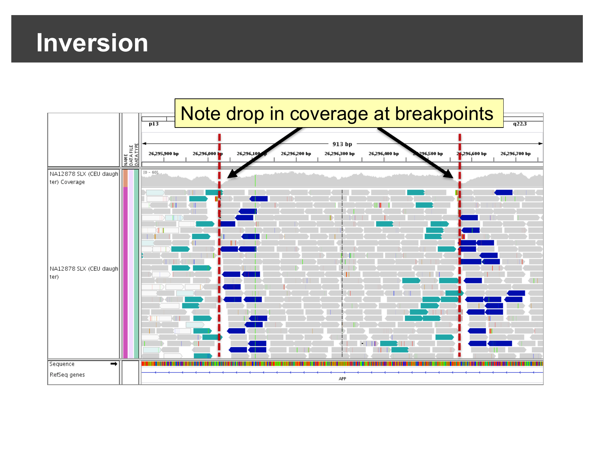
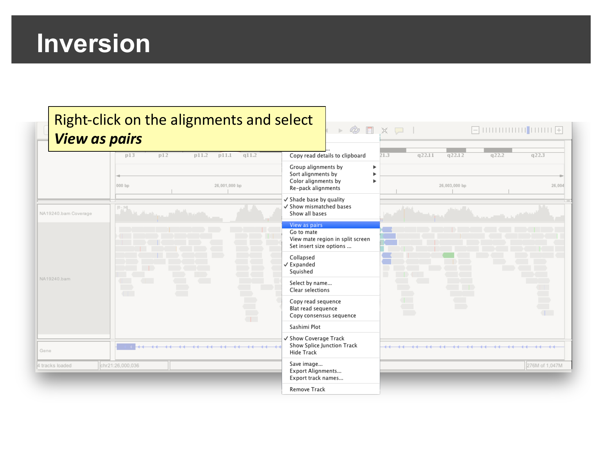
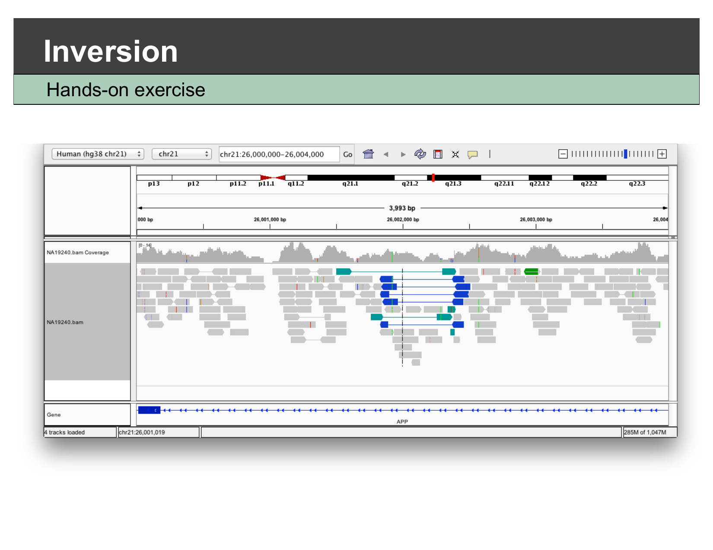

::::::::::::::::::::::::::::::::::::::: objectives

- Explain how paired-end insert size and pair orientation can reveal
  structural variants without a dedicated SV caller.
- Recognize the alignment signatures of a deletion and an inter-chromosomal
  fusion.
- Use **View as pairs** to confirm an inversion breakpoint in real sequencing
  data.

::::::::::::::::::::::::::::::::::::::::::::::::::

:::::::::::::::::::::::::::::::::::::::: questions

- How can paired-end reads reveal deletions, fusions, and inversions?
- How do I confirm a candidate structural variant in IGV?

::::::::::::::::::::::::::::::::::::::::::::::::::

## Background: insert size and pair orientation

For paired-end sequencing, each DNA fragment is read from both ends. When a
read pair aligns to the reference genome, IGV can measure the **inferred
insert size** — the distance between the outer edges of the two aligned
mates — and compare it to the **expected insert size** for the sequencing
library. It can also check whether the pair's orientation (which strand each
mate aligns to) matches what a normal, non-rearranged fragment should look
like.

{alt='Diagram distinguishing insert size from inferred insert size'}

Differences between the expected and observed insert size or orientation are
exactly the kind of evidence dedicated structural variant callers look for —
and you can see the same evidence directly in IGV, without running a caller
at all.

## Detecting deletions

If the subject genome has a **deletion** relative to the reference, a read
pair that happens to span the deleted region will still align its two mates
correctly, but the *distance* between them on the reference will be larger
than expected — because the deleted bases are missing from the subject, but
still present in the reference coordinates the mates are placed in.

IGV colors pairs with a larger-than-expected inferred insert size **red**,
making them easy to spot:

{alt='Diagram showing read pairs colored red when their inferred insert size exceeds the expected value'}

In a real dataset, this shows up as a cluster of red pairs exactly at the
deletion's two breakpoints, together with a visible drop in coverage between
them:

{alt='IGV split-screen view showing red discordant pairs and a coverage drop at a deletion breakpoint'}

## Detecting inter-chromosomal fusions

A **fusion** joins sequence from two different chromosomes together. Reads
sequenced across the fusion junction have one mate on each original
chromosome. IGV's **Color alignments by > read strand/mate chromosome**
option colors each read by *the chromosome its mate is on*, using a fixed
color per chromosome:

{alt='Chromosome color legend used for mate-chromosome coloring'}

In a real tumor/normal comparison, reads colored by an unexpected chromosome
cluster right at the fusion breakpoint in the tumor sample, with no such
evidence in the matched normal sample:

{alt='Split-screen view of a chr1/chr6 fusion, tumor sample showing discordant mate-chromosome coloring, normal sample showing none'}

## Detecting inversions

An **inversion** flips the orientation of a segment of the genome between
two breakpoints. A read pair with one mate inside the inverted segment and
one mate outside it no longer faces its mate in the usual way — instead of
the normal "facing inward" orientation, both mates end up aligned to the
*same* strand (both forward, or both reverse). IGV's pair-orientation
coloring highlights these same-strand pairs, so they stand out clearly at
each inversion breakpoint:

{alt='Diagram showing forward-forward and reverse-reverse discordant pair orientations at the two breakpoints of an inversion'}

Here is a real inversion, viewed at base-pair-scale resolution across the
*APP* gene: a cluster of discordantly-oriented reads (colored teal or dark
blue) and a visible drop in coverage sit right at each breakpoint.

{alt='IGV view of an inversion at the APP gene showing discordant read orientation and coverage drops at both breakpoints'}

## Hands-on: confirm an inversion yourself

The workshop data includes a second sample sequenced across this same region
of chromosome 21. Select **File > Open Session…**, navigate to
`igvData/svs/`, and open `svs_session.xml`. This loads the `hg38_chr21`
genome, the alignment file `NA19240.bam`, and jumps straight to
`chr21:26,000,000-26,004,000` — the *APP* locus.

:::::::::::::::::::::::::::::::::::::::::  callout

## Who is NA19240?

`NA19240` is a well-characterized human lymphoblastoid cell line (a
B-lymphocyte line immortalized with Epstein-Barr virus) from a Yoruba woman
from Ibadan, Nigeria. She is the child in one of the trios (alongside her
parents, `NA19238` and `NA19239`) sequenced by the International HapMap
Project and later the 1000 Genomes Project. Because her genome has been
sequenced and validated so extensively — including as a parent-child trio,
which lets structural variant calls be cross-checked for Mendelian
consistency — `NA19240` is widely reused as a reference/benchmarking sample
across genomics and sequencing-technology studies, including this one.

::::::::::::::::::::::::::::::::::::::::::::::::::

Right-click on the alignments and select **View as pairs**.

{alt='Right-click context menu with View as pairs highlighted'}

Once paired, look for the same signature you just saw in the demo: a cluster
of discordantly-colored, same-strand read pairs, roughly in the middle of
the visible region.

{alt='IGV view of NA19240.bam at the APP locus after enabling View as pairs, showing a cluster of discordant reads'}

:::::::::::::::::::::::::::::::::::::::  challenge

## What confirms this is an inversion, and not a deletion?

Both a deletion and an inversion can produce a visible drop in coverage at
their breakpoints. What *additional* piece of evidence, visible in this
view, tells you this is specifically an inversion rather than a deletion?

:::::::::::::::  solution

## Solution

The **coloring/orientation** of the discordant reads. A deletion produces
pairs with a larger-than-expected insert size but a *normal* forward/reverse
orientation (colored red in this deck's convention). An inversion instead
produces pairs where both mates end up on the *same* strand relative to the
reference (colored teal or dark blue here) — a orientation change, not just
a distance change. Seeing same-strand pairs clustered at the breakpoints,
rather than red long-insert pairs, is what points specifically to an
inversion.

:::::::::::::::::::::::::

::::::::::::::::::::::::::::::::::::::::::::::::::

:::::::::::::::::::::::::::::::::::::::::  callout

## This is what SV callers automate

Dedicated structural variant callers (e.g. Delly, Manta, Lumpy) formalize
exactly this kind of paired-end evidence — insert size, orientation, and
split reads — across a whole genome, and output the results as a VCF you
could load and view the same way you did in the previous episode. What you
just did by eye for one locus is the same signal those tools search for
everywhere.

::::::::::::::::::::::::::::::::::::::::::::::::::

:::::::::::::::::::::::::::::::::::::::: keypoints

- IGV can color read pairs by inferred insert size or by orientation, which
  reveals deletions, insertions, inter-chromosomal fusions, and inversions
  without running a dedicated SV caller.
- A deletion shows up as pairs with a larger-than-expected insert size
  (colored red) and a coverage drop between two breakpoints.
- A fusion shows up as reads colored by an unexpected mate chromosome,
  clustered at the fusion junction.
- An inversion shows up as same-strand (forward-forward or reverse-reverse)
  discordant pairs at its two breakpoints; right-click **View as pairs** to
  see this clearly.

::::::::::::::::::::::::::::::::::::::::::::::::::
