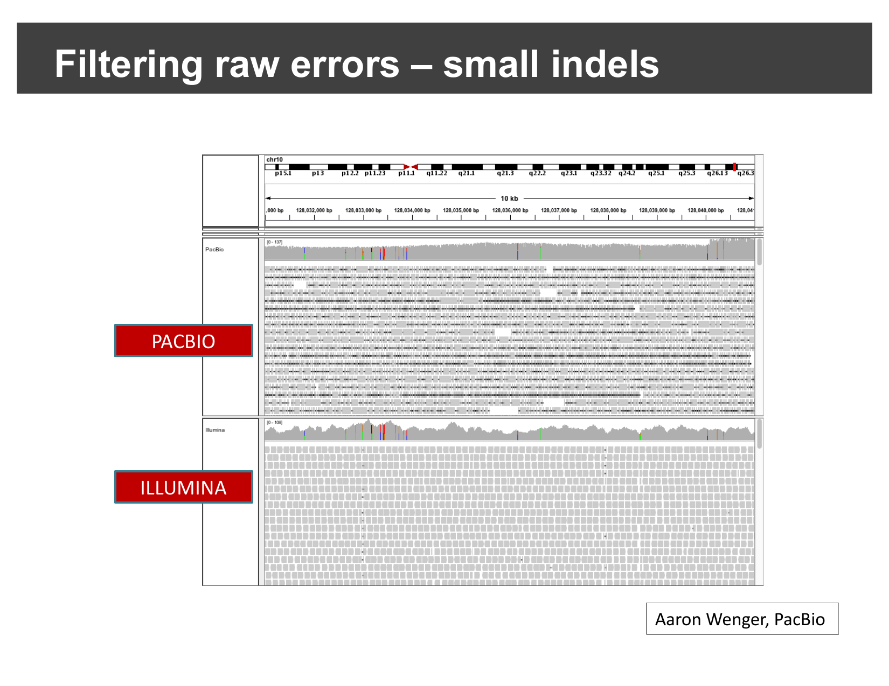
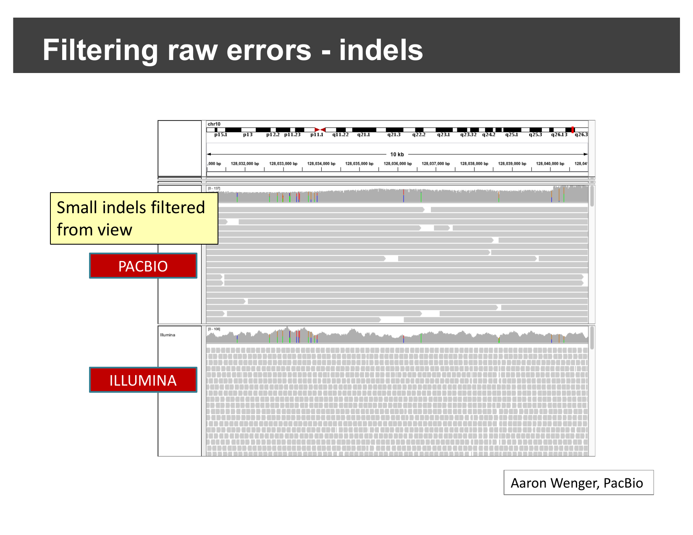
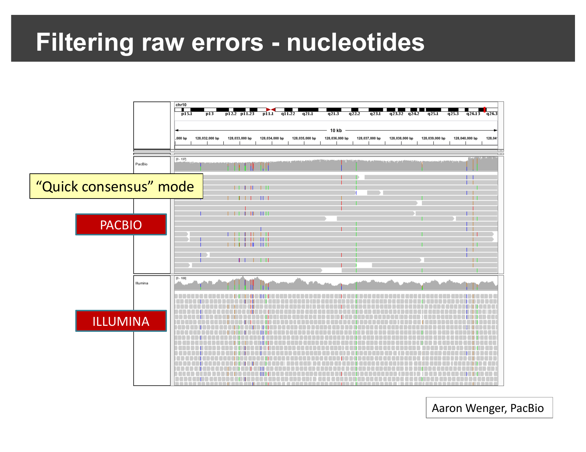
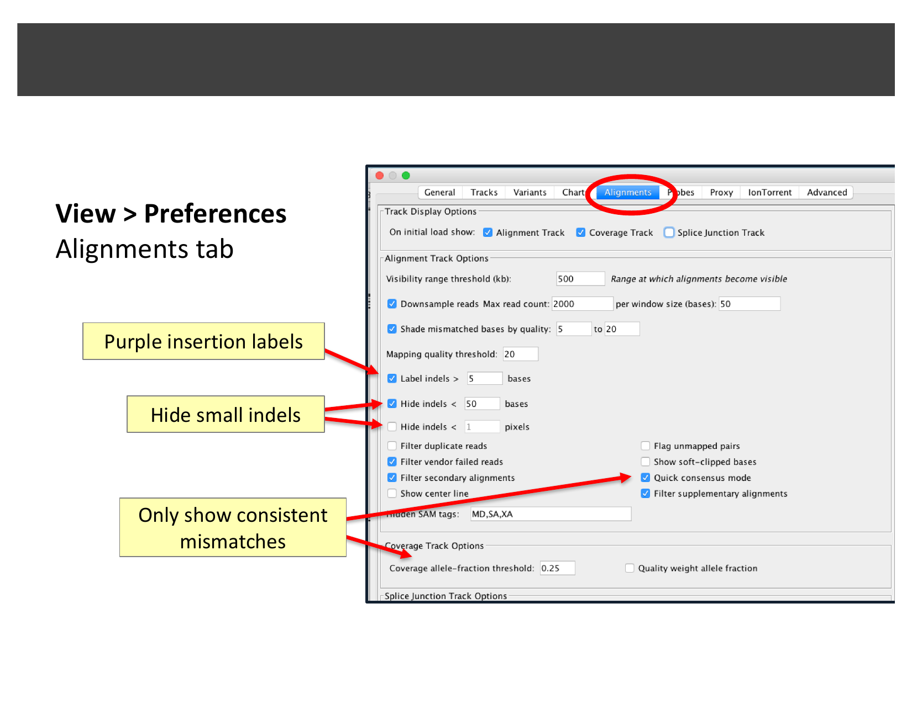
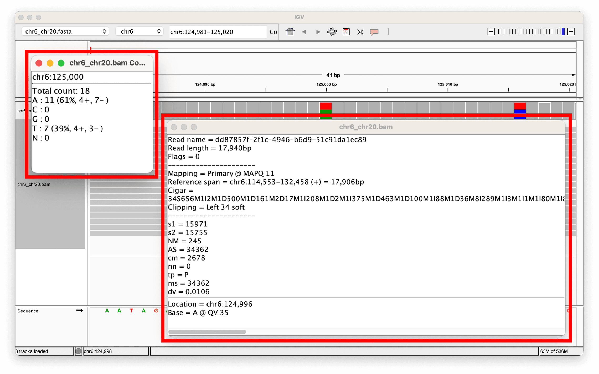
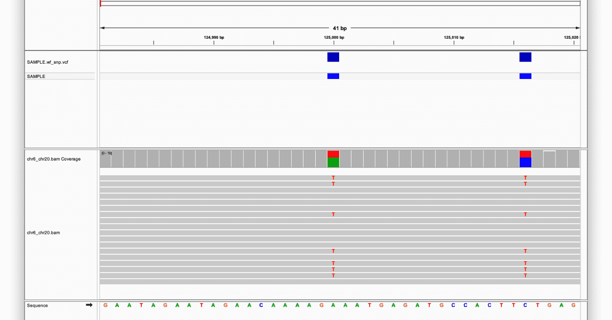
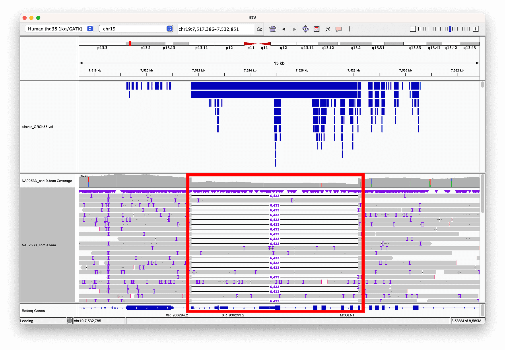
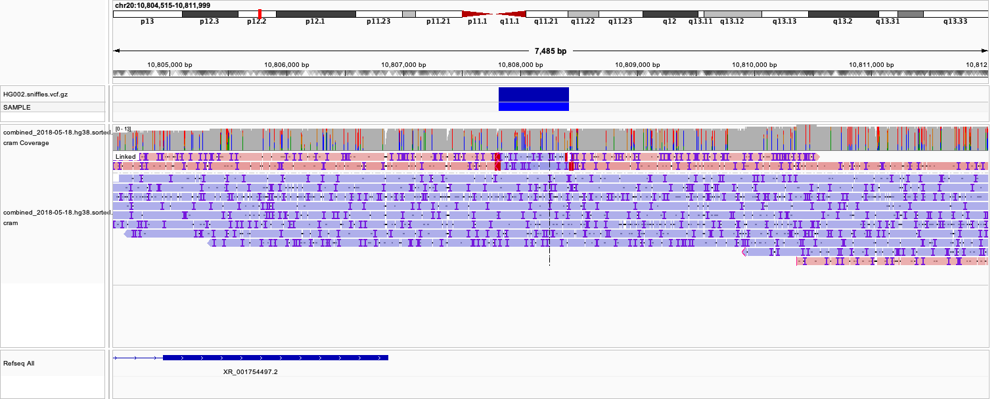
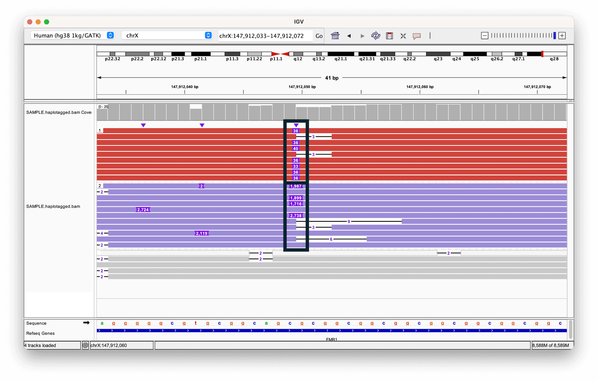

::::::::::::::::::::::::::::::::::::::: objectives

- Explain how long-read sequencing (PacBio, Oxford Nanopore) differs from
  short-read sequencing in IGV.
- Use IGV's alignment preferences to filter raw long-read errors and reveal
  consensus signal.
- Interpret mapping quality (MAPQ) when assessing a long-read alignment.
- Recognize split reads as evidence for structural variants in long-read
  data.
- Load a remote CRAM file directly from a public archive and use linked
  supplementary alignments and strand coloring to confirm an inversion.
- Use haplotype-tag coloring to visualize phased variants.

::::::::::::::::::::::::::::::::::::::::::::::::::

:::::::::::::::::::::::::::::::::::::::: questions

- How does IGV handle long reads differently from short Illumina reads?
- How do I tell real signal from raw sequencing error in noisy long reads?
- How can long reads and read phasing help interpret structural variants and
  repeat expansions?
- Can IGV view a file that lives on a remote server, without downloading it
  first?

::::::::::::::::::::::::::::::::::::::::::::::::::

:::::::::::::::::::::::::::::::::::::::::  callout

## This episode is optional

This is a supplementary episode — cover it only if time allows. It does not
use the workshop's `igvData` files; instead it walks through published
examples and one live hands-on exercise using public data streamed directly
from a remote server (which needs an internet connection).

::::::::::::::::::::::::::::::::::::::::::::::::::

## Background: what makes long reads different

Illumina ("short-read") sequencing produces reads a few hundred base pairs
long with a very low per-base error rate. Third-generation platforms —
PacBio and Oxford Nanopore — instead produce **long reads**, roughly 10,000
to 100,000 base pairs, at the cost of a much **higher raw error rate in each
individual read**. With enough coverage, those per-read errors average out
into a highly accurate *consensus*, but any single long read, viewed on its
own in IGV, looks considerably noisier than a short Illumina read.

## Filtering raw errors to see the consensus signal

Because of this, IGV includes alignment display options specifically aimed
at long reads: filtering out raw single-read errors so the underlying
consensus signal is easier to see, and extended support for split
alignments (linking a read's split parts together, using the `SA` BAM tag).

Compare the same 10 kb region of chromosome 10, sequenced with both PacBio
and Illumina:

{alt='PacBio and Illumina alignments at the same locus, PacBio showing many more small mismatches/indels'}

Most of that PacBio noise is small indels — a single insertion or deletion
of a few bases in an individual read, not a real biological difference from
the reference. Hiding indels below a chosen size (and enabling **quick
consensus mode**, which suppresses a mismatch unless it is shared by enough
reads to look real) filters this out:

{alt='PacBio alignments with small indels filtered out, closely resembling the Illumina track'}

The same idea applies to single-base mismatches. With quick consensus mode
enabled, only mismatches that recur consistently across reads (a real
variant) are still shown; one-off raw sequencing errors are suppressed:

{alt='PacBio alignments after enabling quick consensus mode, showing only consistent mismatches'}

These options live under **View > Preferences… > Alignments**:

{alt='IGV Preferences dialog, Alignments tab, with indel and quick-consensus-mode options highlighted'}

:::::::::::::::::::::::::::::::::::::::  challenge

## Why filter at all?

If quick consensus mode and indel-hiding can suppress real, rare variants
along with sequencing noise, why would you ever want to turn them on?

:::::::::::::::  solution

## Solution

They trade a small risk of hiding a genuine low-frequency variant for a
much larger gain in readability: without filtering, a long-read track can
be so dense with single-read noise that a real, well-supported signal is
hard to distinguish by eye. Filtering is a first-pass visual aid — for any
locus you are seriously evaluating, you would still want to check the
unfiltered view and the read-level evidence before ruling a variant real or
an artifact.

:::::::::::::::::::::::::

::::::::::::::::::::::::::::::::::::::::::::::::::

## Real examples: reviewing nanopore BAM files

The examples below are adapted from Oxford Nanopore's EPI2ME team's guide,
["A guide to reviewing BAM files"][epi2me-bam] — reproduced here with
attribution; the screenshots in this section remain © Oxford Nanopore
Technologies and are not covered by this lesson's CC-BY license.

Before loading any BAM file, two things matter regardless of sequencing
platform: it must be aligned against the **same reference genome** you have
selected in IGV (mismatched coordinates can misdisplay data or crash IGV),
and it should be **sorted and indexed** first.

### Mapping quality (MAPQ)

Every aligned read carries a MAPQ score (0–255) reflecting how confident the
aligner is that the read belongs at that exact genomic location — higher is
more confident. Clicking a read in IGV shows its MAPQ directly:

{alt='IGV read-details popup showing read length, MAPQ score, and CIGAR string for a nanopore read'}

Clicking the coverage track instead shows the allele counts at that
position — here, a heterozygous site with 11 reads (61%) supporting the
reference base and 7 reads (39%) supporting an alternate base:

{alt='IGV coverage and alignment view showing two heterozygous SNVs with a VCF track above'}

A MAPQ in the low single digits (as opposed to 60, a common "fully
confident" ceiling) is a warning sign: reads that cannot be confidently
placed at a unique location make any variant called from them less
trustworthy — the same caution you applied to BLAT results in
[Viewing Alignments and SNPs](04-viewing-alignments-and-snps.md).

### Split reads as evidence for structural variants

A single long read spanning a structural variant breakpoint does not need a
*second* read to reveal it (unlike the paired-end evidence used in
[Viewing Structural Variants](08-viewing-structural-variants.md)) — the read
itself can be **split**: part of it aligns on one side of the breakpoint,
part on the other. Sorting reads by length and looking for this pattern
makes large events easy to spot. Here, a 6 kb deletion in a reference sample
(called by the structural variant caller Sniffles2) is directly visible as
reads that align partially, then resume on the far side of the deleted
region — with a ClinVar annotation track confirming the deletion is a known
clinically-relevant variant:

{alt='IGV view of a large deletion visible via split long reads, with a ClinVar VCF annotation track'}

## Hands-on: find an inversion in public long-read data

You can try this yourself, on real public data, without downloading
anything first. **File > Load from URL…** lets IGV stream just the bytes it
needs directly from a remote server, the same way **Load from Server…**
does for IGV's own hosted datasets.

This example uses ultra-long Oxford Nanopore reads for HG002, the
Ashkenazim trio son reference sample from the
[Genome in a Bottle (GIAB) Consortium][giab], aligned to hg38 and hosted by
NCBI.

1. Select **Human hg38** from the genome drop-down menu.
2. Select **File > Load from URL…** and paste:

  ```output
  https://ftp-trace.ncbi.nlm.nih.gov/giab/ftp/data/AshkenazimTrio/HG002_NA24385_son/Ultralong_OxfordNanopore/combined_2018-05-18/combined_2018-05-18.hg38.sorted.cram
  ```

  IGV automatically finds the matching `.crai` index at the same URL — you
  do not need to load it separately. (The CRAM file itself is over 10 GB,
  but IGV only ever requests the small portion of it covering the region
  you are viewing.)

3. Type `chr20:10,804,515-10,811,999` into the search box and click **Go**.

At this zoom level you will see the same dense, indel-heavy raw signal
described earlier in this episode — feel free to apply quick consensus mode
here too. To reveal the structural signal underneath it:

4. Right-click the alignments and select **Link supplementary alignments**.
  Long reads spanning a structural variant breakpoint are often aligned as
  a primary alignment plus one or more separate *supplementary* alignments;
  this option draws all the pieces of one read on a single row, connected
  by a thin line — the direct long-read equivalent of the paired-end
  linking you used with **View as pairs** in the previous episode.
5. Right-click again and select **Color alignments by > Read strand**.

{alt='IGV view of HG002 ultra-long nanopore reads at a chr20 locus, linked supplementary alignments and colored by read strand, showing a block of reverse-strand-colored reads flanked by forward-strand reads'}

Most reads across this region are colored pink (forward strand). A block of
reads in the middle of the view, however, switches to purple (reverse
strand) before switching back — exactly the same-strand-block-then-switch-back
pattern you would expect if a segment of the genome were inverted between
two nearby breakpoints, this time visible directly within single linked
reads rather than needing separate discordant pairs.

:::::::::::::::::::::::::::::::::::::::  challenge

## Where are the breakpoints?

Using the color switch as a guide, estimate the two breakpoints of this
inversion from the view. (For comparison: this call was originally made by
the long-read structural variant caller Sniffles2, the same tool used for
the deletion example earlier in this episode.)

:::::::::::::::  solution

## Solution

The breakpoints sit wherever the read coloring switches from pink to purple
(the first breakpoint) and back from purple to pink (the second) — at
roughly `chr20:10,807,800` and `chr20:10,808,450` in this data. You do not
need Sniffles2 (or any variant caller) to find this — the same visual
evidence a caller uses is directly visible once the reads are linked and
colored by strand.

:::::::::::::::::::::::::

::::::::::::::::::::::::::::::::::::::::::::::::::

### Haplotype phasing

Long reads are also long enough to span multiple nearby variants on the
*same* physical DNA molecule, which lets phasing tools (such as WhatsHap or
LongPhase) tag each read with which parental haplotype it belongs to (the
`HP` BAM tag). Coloring and sorting reads by `HP` groups them into their two
haplotypes, making it easy to compare alleles side by side. In this example
— a short tandem repeat expansion in the *FMR1* gene — one haplotype carries
a much larger insertion than the other; grey reads could not be confidently
assigned to either haplotype:

{alt='IGV view of reads grouped by haplotype tag showing different insertion sizes between the two alleles at an FMR1 repeat expansion'}

:::::::::::::::::::::::::::::::::::::::  challenge

## Why does phasing matter here?

Both alleles in the example above contain an insertion, just of different
sizes. Why is knowing *which reads belong to which haplotype* useful,
rather than just looking at the insertion sizes across all reads together?

:::::::::::::::  solution

## Solution

Without phasing, you would see a mix of insertion sizes at the locus and
have to guess whether that reflects two distinct alleles (e.g. one normal,
one expanded) or a more continuous, noisy distribution. Grouping reads by
haplotype turns that ambiguous mixture into two clean, separately
interpretable groups — letting you say, for example, "this individual has
one allele of roughly this repeat length and a second allele of roughly
that length," which is exactly the kind of call needed to assess conditions
like Fragile X syndrome (associated with *FMR1* repeat expansions).

:::::::::::::::::::::::::

::::::::::::::::::::::::::::::::::::::::::::::::::

[epi2me-bam]: https://epi2me.nanoporetech.com/reviewing-bam/
[giab]: https://www.nist.gov/programs-projects/genome-bottle

:::::::::::::::::::::::::::::::::::::::: keypoints

- Long reads (PacBio, Oxford Nanopore) trade a higher per-read error rate
  for much greater length than short Illumina reads.
- IGV's **quick consensus mode** and indel-hiding thresholds (**View >
  Preferences > Alignments**) filter raw long-read noise so consensus
  signal is easier to see.
- A read's MAPQ score (0–255) reflects alignment confidence; low MAPQ is a
  warning sign for any variant called from that read.
- **File > Load from URL…** streams a remote BAM/CRAM directly from a
  server (finding its index automatically), without downloading the whole
  file first.
- **Link supplementary alignments** connects a single long read's split
  pieces on one row; combined with **Color alignments by > Read strand**
  (pink = forward, purple = reverse), this reveals an inversion directly
  within individual reads.
- A single long read can directly reveal a structural variant by splitting
  across its breakpoint, without needing paired-end evidence.
- Coloring and grouping reads by haplotype (`HP`) tag separates two alleles
  for direct comparison, useful for phased variants and repeat expansions.

::::::::::::::::::::::::::::::::::::::::::::::::::
