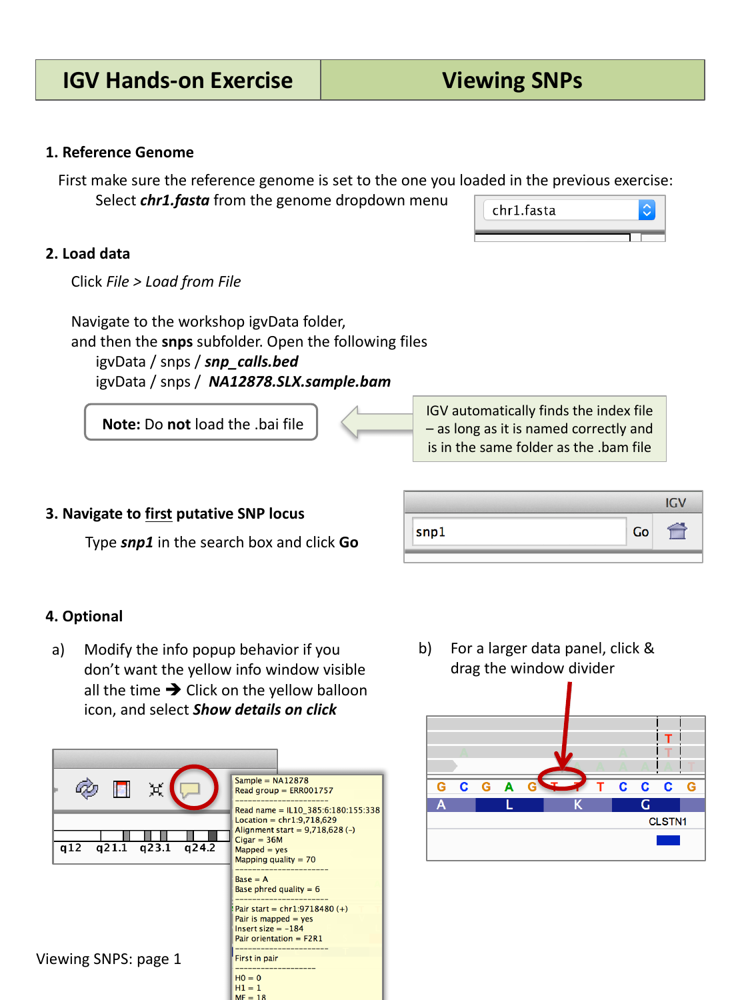
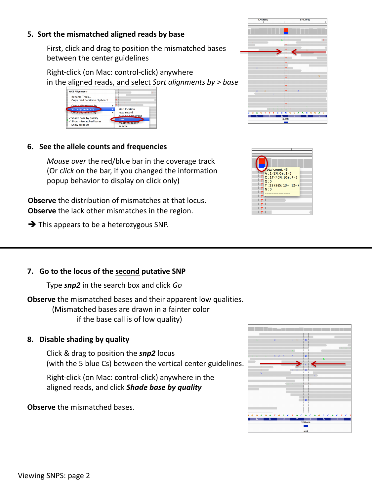
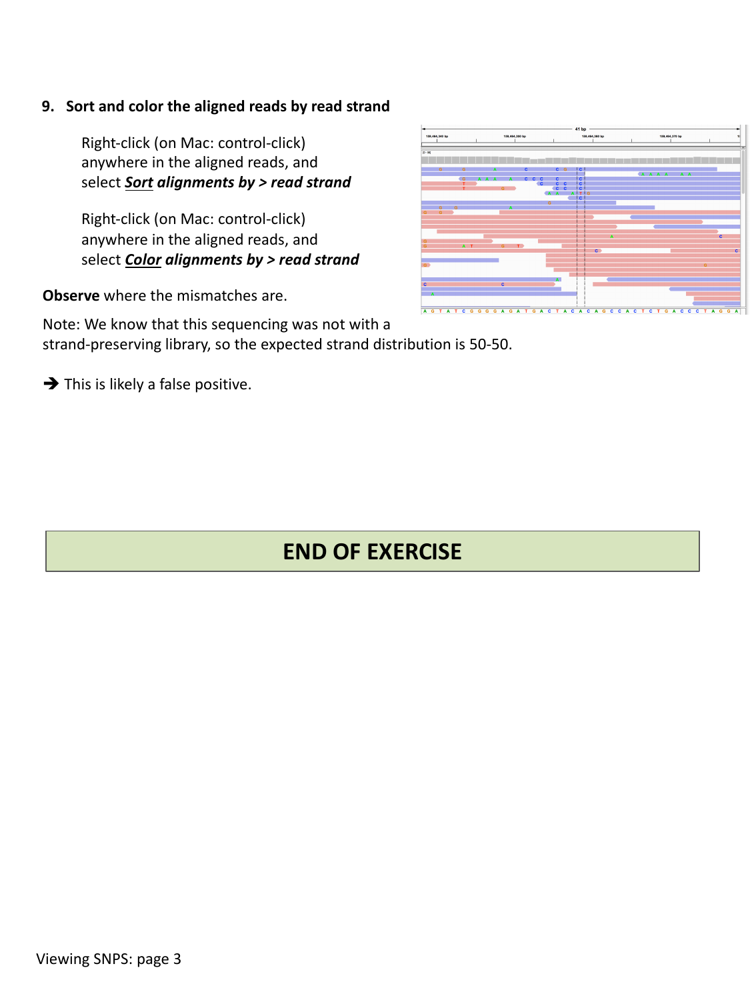

::::::::::::::::::::::::::::::::::::::: objectives

- Load aligned sequencing reads from a BAM file alongside a BED file of
  candidate variant sites.
- Read mismatched bases, coverage, and allele counts from an alignment track.
- Sort and color aligned reads to help distinguish real variants from
  artifacts.

::::::::::::::::::::::::::::::::::::::::::::::::::

:::::::::::::::::::::::::::::::::::::::: questions

- How do I inspect individual sequencing reads that support a candidate
  variant?
- How can I tell a real SNP apart from a technical artifact?

::::::::::::::::::::::::::::::::::::::::::::::::::

## Reference genome

Make sure the reference genome is still set to the one you loaded in the
previous episode: select `chr1.fasta` from the genome drop-down menu if
needed.

## Load the alignment and candidate SNP data

Select **File > Load from File…**, navigate to `igvData/snps/`, and open:

- `snp_calls.bed` — a BED file marking two candidate SNP loci, and
- `NA12878.SLX.sample.bam` — a small sample alignment file.

:::::::::::::::::::::::::::::::::::::::::  callout

## Loading a BAM file's index

IGV automatically finds a BAM file's index (`.bai`) as long as it is named
correctly (e.g. `NA12878.SLX.sample.bam.bai`) and sits in the same folder as
the BAM file. Do **not** load the `.bai` file directly — only load the
`.bam` file.

::::::::::::::::::::::::::::::::::::::::::::::::::

## Navigate to the first candidate SNP

Type `snp1` into the search box and click **Go**.

{alt='IGV showing the loaded alignment track and search box with snp1'}

You should see individual aligned reads stacked as grey bars, with a red or
blue bar above them summarizing the coverage and any mismatches at each
position (the coverage track).

:::::::::::::::::::::::::::::::::::::::::  callout

## Popup behavior

By default, hovering over a read shows a popup with details (read name,
alignment position, mapping quality, and more). If you would rather the
popup only appear on click, click the yellow speech-bubble icon in the
toolbar and choose **Show details on click**.

::::::::::::::::::::::::::::::::::::::::::::::::::

## Sort reads by base to spot a real mismatch

First, click and drag to position the mismatched bases between the two
vertical center guidelines. Then right-click (Mac: control-click) anywhere in
the aligned reads and select **Sort alignments by > base**.

Mouse over (or click) the colored bar in the coverage track to see the exact
allele counts and frequencies at that position.

{alt='Sorted alignments and allele count popup'}

Observe the distribution of mismatches at this locus, and the lack of other
mismatches nearby. This pattern — a consistent mismatch across many reads, at
roughly the frequency you would expect for a heterozygous site, with no other
noise around it — is a good sign of a real heterozygous SNP.

:::::::::::::::::::::::::::::::::::::::  challenge

## Compare the two candidate SNPs

Go to the locus of the second candidate SNP by typing `snp2` into the search
box and clicking **Go**. Compare what you see to `snp1` — in particular,
look at the color/brightness of the mismatched bases (a fainter color
indicates a lower base quality). Right-click the aligned reads and toggle
**Shade base by quality** off and on to compare.

:::::::::::::::  solution

## Solution

At `snp2`, many of the mismatched bases are drawn faintly, meaning IGV is
shading them by low base call quality. Turning off **Shade base by quality**
makes every mismatch look equally solid, which can be misleading — with
shading on, it becomes clear that this locus is dominated by low-quality
base calls rather than a strong, consistent signal like at `snp1`. This is a
warning sign that `snp2` may not be a real variant.

:::::::::::::::::::::::::

::::::::::::::::::::::::::::::::::::::::::::::::::

## Sort and color reads by strand

Right-click anywhere in the aligned reads and select **Sort alignments by >
read strand**, then right-click again and select **Color alignments by >
read strand**.

{alt='Alignments colored and sorted by read strand'}

Observe where the mismatches fall relative to strand. If a sequencing library
was **not** strand-specific, you would expect roughly a 50/50 split of reads
on each strand, and a real variant should appear consistently on reads from
both strands. If a mismatch only ever appears on reads from one strand, that
is a red flag for a strand-specific artifact rather than a genuine variant.

:::::::::::::::::::::::::::::::::::::::  challenge

## Decide: real SNP or artifact?

Using strand sorting/coloring, examine `snp2` again. Given that this
sequencing library was **not** strand-preserving (so you would expect the
mismatch on both strands roughly equally), what do you conclude about
`snp2`?

:::::::::::::::  solution

## Solution

If the mismatched bases at `snp2` are concentrated on reads from only one
strand, despite the library not being strand-specific, this locus is likely
a **false positive** rather than a real heterozygous SNP — combined with the
low base quality observed earlier, there are now two independent pieces of
evidence against it being real.

:::::::::::::::::::::::::

::::::::::::::::::::::::::::::::::::::::::::::::::

:::::::::::::::::::::::::::::::::::::::: keypoints

- Load a BAM file with **File > Load from File…**; IGV finds its `.bai`
  index automatically as long as it is named correctly and kept alongside the
  BAM file.
- Sorting and coloring aligned reads (by base, by base quality shading, or by
  read strand) helps you distinguish a real variant from a sequencing or
  alignment artifact.
- Warning signs of a false-positive variant include low base quality and a
  mismatch that only appears on reads from one strand when it should not.

::::::::::::::::::::::::::::::::::::::::::::::::::
