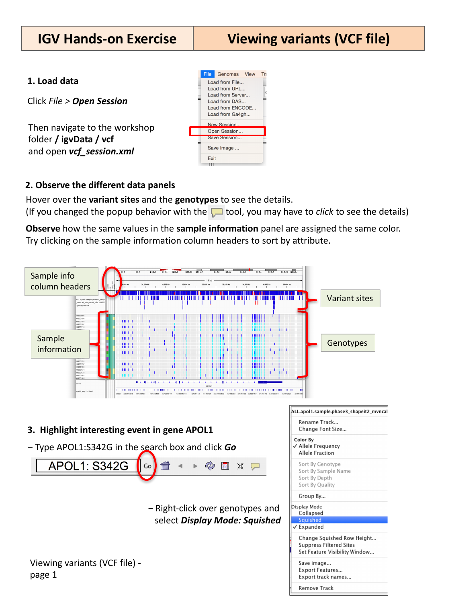

::::::::::::::::::::::::::::::::::::::: objectives

- Load a multi-sample VCF file together with its sample metadata.
- Distinguish the variant sites panel from the per-sample genotypes panel.
- Group and compare genotypes across sample populations.

::::::::::::::::::::::::::::::::::::::::::::::::::

:::::::::::::::::::::::::::::::::::::::: questions

- How does IGV display variants and genotypes from a VCF file?
- How can I compare variant patterns across groups of samples, such as
  populations?

::::::::::::::::::::::::::::::::::::::::::::::::::

## Load the session

This exercise uses a pre-built IGV session that loads a population VCF file
together with sample attribute information (population and sex for each
sample). Select **File > Open Session…**, navigate to `igvData/vcf/`, and
open `vcf_session.xml`.

## Observe the variant and genotype panels

IGV splits VCF data into two panels:

- a **variant sites** panel (one row) showing where variants are located
  along the genome, and
- a **genotypes** panel (one row per sample) showing each sample's genotype
  at every variant site.

{alt='IGV VCF session with variant sites, genotypes, and sample info panel'}

Hover over a variant site or a genotype cell to see its details in a popup.
(If you changed the popup behavior earlier to "on click", click instead of
hovering.)

A narrow **sample information** column to the left of the genotypes uses
color to represent each sample's metadata (e.g. population). Samples sharing
the same value are shown in the same color. Try clicking on the sample
information column headers to sort samples by an attribute.

## Highlight variants in a gene of interest

Type `APOL1:S342G` into the search box and click **Go** to jump to a specific
amino-acid-level variant in the *APOL1* gene.

Right-click over the genotypes track and select **Display Mode: Squished**
to make room for more samples on screen at once.

## Group samples by population

Right-click over the genotypes track again, select **Group By…**, and choose
the **super_pop** attribute.

{alt='Group By dialog and genotypes grouped by super population'}

Use the scrollbar to scroll down through all the population groups.

:::::::::::::::::::::::::::::::::::::::  challenge

## Compare variant frequency across populations

At the `APOL1:S342G` locus, scroll through the population groups you just
created. Is this variant equally common in every population group?

:::::::::::::::  solution

## Solution

No — the variants at this locus are not evenly distributed. They are absent,
or nearly absent, in some population groups, and much more prevalent in
others. This kind of population-stratified pattern is common for variants
under different selective pressures (or genetic drift) in different
ancestral populations, and grouping genotypes by population makes this kind
of pattern immediately visible, without needing to compute allele
frequencies separately for each group.

:::::::::::::::::::::::::

::::::::::::::::::::::::::::::::::::::::::::::::::

:::::::::::::::::::::::::::::::::::::::::  callout

## Coloring genotypes

The genotype track's right-click menu also offers **Color By > Allele
Frequency** or **Allele Fraction**, and options to sort by genotype, sample
name, depth, or quality — useful alternatives or complements to grouping by a
sample attribute.

::::::::::::::::::::::::::::::::::::::::::::::::::

:::::::::::::::::::::::::::::::::::::::: keypoints

- A VCF track in IGV has a variant sites panel and a per-sample genotypes
  panel; a sample information color bar can show sample metadata such as
  population.
- Search for a variant using `gene:protein-change` syntax (e.g.
  `APOL1:S342G`) as well as by coordinate or gene name.
- Grouping genotypes by a sample attribute (e.g. population) makes it easy to
  compare variant patterns across groups of samples.

::::::::::::::::::::::::::::::::::::::::::::::::::
